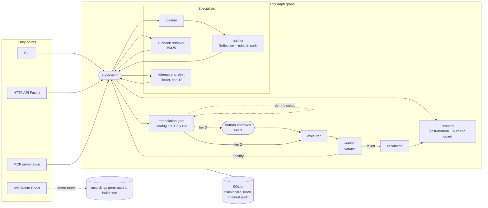

<div align="center">

# incident-copilot

**A multi-agent incident copilot in TypeScript: the model proposes; code and humans decide.**

[](https://github.com/flaviorg/incident-copilot/actions/workflows/ci.yml)
[](LICENSE)
[](.nvmrc)
[](tsconfig.json)
[](#tests-and-quality)

[**Live War Room demo**](https://flaviorg.github.io/incident-copilot/) · [Quick start](#quick-start) · [Architecture](docs/architecture.md) · [Threat model](docs/threat-model.md)

</div>

A LangGraph supervisor coordinates telemetry, runbook, planning and audit agents. Risky actions go through an autonomy matrix with human approval, and forbidden ones never run, even when the model proposes them. MTTR and savings are computed from data, not by the LLM. It runs offline with a scripted fake LLM; plug in OpenRouter with two environment variables (API key and model).

> **Note on language.** The documentation under `docs/`, `specs/` and the CLI output are written in Brazilian Portuguese (this is a portfolio project for a Brazilian course). Terminal output blocks below are real program output and are kept verbatim.

<p align="center">
  <a href="https://flaviorg.github.io/incident-copilot/">
    
  </a>
</p>

<p align="center"><sub>Replay of a recorded run with a scripted fake provider. Deploy scenario: the team investigates, the gate stops at the tier 3 <code>rollback_deployment</code>, the human approves, and MTTR and time waiting for approval appear.</sub></p>

## Table of contents

- [Why this project exists](#why-this-project-exists)
- [Highlights](#highlights)
- [Architecture](#architecture)
- [Quick start](#quick-start)
- [Usage](#usage): [CLI](#cli) · [HTTP API](#http-api) · [MCP server](#mcp-server) · [War Room](#war-room) · [Real model](#using-a-real-model-openrouter)
- [Scenarios](#scenarios)
- [Security and guardrails](#security-and-guardrails)
- [Numbers without invention](#numbers-without-invention)
- [Tests and quality](#tests-and-quality)
- [Folder structure](#folder-structure)
- [Course lessons applied](#course-lessons-applied)
- [What I changed from the course](#what-i-changed-from-the-course)
- [Known limitations](#known-limitations)
- [License](#license)

## Why this project exists

LLM agents can already investigate an incident and propose a fix. The problem is trusting them to execute it: a model can get the diagnosis wrong, invent a number in the post-mortem, or be convinced by a hostile log line to delete backups. This repository defends a simple thesis with tests: **the model proposes; code and humans decide.** The LLM picks the next specialist, investigates, plans and writes. The risk tier, the approval, the execution, the numbers and the audit stay with deterministic code and a person.

## Highlights

- **A team of agents with a supervisor** (LangGraph): a telemetry analyst using ReAct (cap of 12), a BM25 runbook retriever, a planner, and an auditor using Reflection. Every handoff becomes a persisted `handoff` event.
- **An Autonomy Matrix with four tiers.** The tier comes from the catalog, never from LLM output. Tier 3 requires human approval; tier 4 is forbidden by construction and does not run even when the model proposes it, including via prompt injection coming from a log.
- **Numbers are computed, not written.** MTTR, time waiting for approval and savings come out of pure functions; a numeric guard rejects any number in the narrative that does not come from those calculations.
- **Four entry points, one core:** CLI, HTTP API (Fastify), MCP server (stdio) and War Room (React 19, published on GitHub Pages).
- **Insert-only audit** with a hash chain over canonical JSON, verifiable by the client.
- **Runs offline**, with no Docker, no key and no network after `npm install`, using a scripted fake LLM; OpenRouter plugs in with two environment variables.
- **340 backend tests and 32 War Room tests, none using the network**, plus SDD specs with 41 acceptance criteria in EARS.

## Architecture



- Every route to escalation is decided by code: the supervisor's decision schema does not have that option.
- The approval pause persists the blackboard in SQLite, and resuming is a new invocation that enters through the executor.
- `src/contracts` and `src/domain` are pure (no `node:*` and no outer layers), and a test guarantees it.

Full diagrams (components, graph, approval state machine), route table and dependency rule: [`docs/architecture.md`](docs/architecture.md).

<details>
<summary><strong>The agents, one by one</strong></summary>

| Agent | LLM | Tools | Produces |
|---|---|---|---|
| Supervisor | yes (`supervisor.v1`) | none | next specialist and `brief`, validated by a guard in code |
| Telemetry analyst | yes (`telemetry-react.v1`), ReAct loop up to 12 steps | `query_metrics`, `query_logs`, `list_deploys`, `audit_cloud_inventory` (tier 1) | diagnosis with an enum category, confidence and evidence |
| Runbook retriever | no | BM25 over `runbooks/` | passages above the threshold, or a refusal |
| Remediation planner | yes (`planner.v1`) | none (sees the catalog as text) | plan of up to 8 steps |
| Plan auditor | yes (`auditor.v1`), plus 5 rules in code as a floor | inventory and deploy queries made by the code | `approve` or `revise`, with up to 2 revisions |
| Remediation gate | no | `classifyAction`, dry run, approval queue | actions by tier |
| Executor | no | simulated world, circuit breaker, rate limiter | executed actions |
| Verifier | no | canary (`analyzeCanary`), rollback | healthy canary or rollback |
| Reporter | yes (`postmortem.v1`), only for the narrative of a resolved incident | pure metrics, numeric guard, template | post-mortem |
| Escalation | no | none | escalation reason |

</details>

## Quick start

Requires Node 24.21 or newer ([`.nvmrc`](.nvmrc)). No LLM key, no Docker and no network after `npm install`.

```bash
git clone https://github.com/flaviorg/incident-copilot.git && cd incident-copilot
npm install
npm run demo
```

The demo forces the fake provider even if your shell has `OPENROUTER_API_KEY` (only `--live` uses the real model). Real output, abridged (the CLI prints in Brazilian Portuguese):

```text
$ npm run demo
incident-copilot · demo · provedor: fake roteirizado (sem rede, sem chave)
cenário deploy-5xx-rollback · serviço orders-api · sev1

09:42:30  INC-0001 aberto: "Taxa de 5xx acima de 5% no orders-api" (impacto desde 09:40:30)
09:42:50  supervisor → analista de telemetria: Correlacione 5xx e latência do orders-api com o deploy v3.8.0
(...)
09:44:19  analista de telemetria → supervisor: diagnóstico bad_deploy (deploy com defeito, confiança alta, 3 evidências)
(...)
09:45:39  auditor → supervisor: plano revisão 0 aprovado (5 de 5 regras ok)
(...)
09:46:05    obs   rollback_deployment faixa 3: dry run ok (deployment/orders-api: v3.8.0 -> v3.7.2 (6 réplicas)) → aguardando APR-0001
(...)
09:46:05  portão de remediação → humano: aguardando aprovação de APR-0001
09:49:05  operador demo aprovou APR-0001 (token verificado, valor omitido)
(...)
09:51:41  canário: aprovado (canário saudável: 5xx 0,5% ≤ 5%; P99 205 ms ≤ 270 ms)
09:51:41  verificador → supervisor: canário saudável; incidente mitigado

desfecho: resolvido (canário saudável)

MTTR                    11,2 min        medido (linha do tempo simulada, 09:40:30 → 09:51:41)
  aguardando aprovação  3,0 min         medido (soma das aprovações decididas)
MTTD                    2,0 min         medido
Minutos economizados    33,8 a 83,8     ilustrativo (linha de base sintética de 45 a 95 min)
ROI                     18,9x a 48,2x   ilustrativo (premissas em data/business-assumptions.json)
Custo de LLM            US$ 0,00        medido (12 chamadas, 14014 tokens)

trace 41 eventos (thought 4 · action 10 · observation 10 · plan 1 · critique 2 · answer 2 · handoff 12)
post-mortem: reports/INC-0001-postmortem.md
```

The full output of both scenarios, line by line, is in [`docs/demo-output.md`](docs/demo-output.md).

## Usage

### CLI

| Command | What it does |
|---|---|
| `npm run demo` | The `deploy-5xx-rollback` scenario with the fake provider, automatic approval by the demo operator |
| `npm run demo -- --reject` | The operator rejects: the rollback is cancelled along with the step that depended on it, and the incident ends escalated with `mitigation_rejected` |
| `npm run demo -- --scenario cost-anomaly` | The FinOps scenario, with Reflection and tier 4 blocked |
| `npm run demo -- --json` | Only the final object |
| `npm run demo -- --persist` | Writes to `data/incident-copilot.db`; the second run becomes `INC-0002` |
| `npm run cli -- demo --live` | The demo with the real model ([see below](#using-a-real-model-openrouter)) |

### HTTP API

`npm start` brings the API up at `127.0.0.1:3000`. Error body: `{ "error": { "code", "message", "requestId", "issues"? } }`, with no stack trace. Every response carries `X-Request-Id`.

| Route | What it does |
|---|---|
| `POST /incidents` | opens an incident and runs the team until `awaiting_approval`, `resolved` or `escalated` |
| `GET /incidents`, `GET /incidents/:id` | list with SQL filtering; full view of the incident |
| `GET /incidents/:id/trace`, `/audit`, `/postmortem` | trace, verifiable audit trail and post-mortem (Markdown or JSON) |
| `GET /approvals`, `POST /approvals/:id/decision` | approval queue; decision with `X-Approval-Token`, which resumes the incident |
| `GET /health`, `GET /scenarios`, `GET /stats` | health, scenarios and SQL statistics (MTTR P50 and P95, tiers, guards, LLM usage) |

<details>
<summary><strong>Real <code>curl</code> sequence</strong> (open, wrong token, ambiguous decision, approve)</summary>

With a fresh database and a local token of 16 or more characters exported in the shell as `APPROVAL_TOKEN` (the value does not appear in any output):

```text
$ curl -s -X POST localhost:3000/incidents -H 'content-type: application/json' -d '{"scenarioId":"deploy-5xx-rollback"}' | jq -c '{id: .incident.id, status: .incident.status, pendentes: [.approvals[] | select(.status=="pending") | .id]}'
{"id":"INC-0001","status":"awaiting_approval","pendentes":["APR-0001"]}

$ curl -s -X POST localhost:3000/approvals/APR-0001/decision -H 'content-type: application/json' -H 'X-Approval-Token: errado-errado-errado' -d '{"decision":"approve","approver":"ana"}' | jq -c .error
{"code":"invalid_token","message":"token de aprovação inválido ou ausente","requestId":"af8556c4-46a9-49aa-85c2-a28c89248c29"}

$ curl -s -X POST localhost:3000/approvals/APR-0001/decision -H 'content-type: application/json' -H "X-Approval-Token: $APPROVAL_TOKEN" -d '{"text":"sim, mas espera","approver":"ana"}' | jq -c .error.code
"ambiguous_decision"

$ curl -s -X POST localhost:3000/approvals/APR-0001/decision -H 'content-type: application/json' -H "X-Approval-Token: $APPROVAL_TOKEN" -d '{"decision":"approve","approver":"ana"}' | jq -c '.incident.incident.status'
"resolved"

$ curl -s 'localhost:3000/incidents/INC-0001/postmortem?format=json' | jq -c .numericGuard
{"passed":false,"rejectedNumbers":["11,2"],"usedTemplate":true}
```

The last command shows the [numeric guard](#numbers-without-invention) at work: with the system clock, the scripted narrative cites "11,2" (the MTTR of the simulated timeline), the real MTTR was different (about 2 min in this example), and the post-mortem came out through the deterministic template.

</details>

All routes with their error codes and the full sequence (`/health`, `/stats`, post-mortem in Markdown): [`docs/http-api.md`](docs/http-api.md).

### MCP server

`npm run mcp` starts the `incident-copilot` stdio server over the same database as the API. Stdout carries only JSON-RPC; all logging goes to stderr. To connect an MCP client, call `node` directly, as in the repository's configs, or use `npm run -s mcp`: without `-s`, npm itself writes two header lines to stdout before the JSON-RPC.

| Tool | What it does |
|---|---|
| `list_incidents` | recent incidents and their status, with filtering |
| `get_incident` | incident view and the latest trace events |
| `propose_remediation` | proposes an action for an `awaiting_approval` incident: tier 2 goes into the ready batch, tier 3 goes to the human queue, tier 4 and unknown types are refused with an audit record |

**No tool approves or executes anything.** The proposal runs together with the batch, after the human decision through the API. To inspect: `npm run mcp:inspect`, which downloads the MCP Inspector with `npx` the first time.

<details>
<summary><strong>Client configuration</strong> (VS Code and Cursor)</summary>

VS Code ([`.vscode/mcp.json`](.vscode/mcp.json), already in the repository):

```json
{
  "servers": {
    "incident-copilot": {
      "type": "stdio",
      "command": "node",
      "args": ["--env-file-if-exists=.env", "src/mcp/server.ts"]
    }
  }
}
```

Cursor uses the same content with the `mcpServers` key ([`.cursor/mcp.json`](.cursor/mcp.json)).

</details>

### War Room

**Live:** [flaviorg.github.io/incident-copilot](https://flaviorg.github.io/incident-copilot/)

The War Room ([`web/`](web/)) is a static page built with React 19 and Vite 8 that replays recordings generated by the backend itself (`npm run demo:record`), with no API needed: a conversation between agents with handoffs, an approval gate with a tier badge (text, icon and color) and both the approve and reject branches, number cards, and a post-mortem with the numeric guard badge.

```bash
npm run web:install   # once: nested package, its own install
npm run web:demo      # generates the recordings and starts Vite
```

<p align="center">
  
</p>
<p align="center"><sub>The cost scenario gate: three pending tier 3 approvals and the tier 4 <code>delete_backups</code> blocked without a dry run. How the media were made: <a href="docs/media/README.md"><code>docs/media/README.md</code></a>.</sub></p>

- **Accessibility.** axe reports no violations on the main screens, the dialog traps focus and closes on Escape, tiers are conveyed by text and icon, keyboard focus follows playback, and the layout collapses to one column on narrow screens. Checklist and evidence in [`docs/accessibility.md`](docs/accessibility.md).
- **Design tokens.** Colors, spacing and typography live only in [`web/src/styles/tokens.css`](web/src/styles/tokens.css), with light and dark themes. `npm run check:tokens` fails on any literal color outside it, and a test proves a contrast ratio of at least 4.5:1 for every declared pair.
- **Publishing.** The manual "Pages (War Room)" workflow ([`.github/workflows/pages.yml`](.github/workflows/pages.yml)) builds with `VITE_BASE=/incident-copilot/` and publishes `web/dist`. Nothing is published unless someone triggers the workflow.

### Using a real model (OpenRouter)

1. Copy [`.env.example`](.env.example) to `.env` and fill in `OPENROUTER_API_KEY` and `OPENROUTER_MODEL`. The model must support structured output. `OPENROUTER_MODEL_FALLBACK` is optional. `.env` is in `.gitignore`, and `check:secrets` (with the pre-commit hook) does not scan it as long as Git does not track it.
2. With the key set and `LLM_PROVIDER` empty, the API, the MCP server and the CLI use OpenRouter. `LLM_PROVIDER=fake` forces the fake even when a key is present.
3. Run:
   - `npm run test:live`: runs the deploy scenario against the real model and checks structure only (category in the enum, steps in the catalog or blocked, numeric guard passed or template used). Without a key, the test is skipped.
   - `npm run cli -- demo --live`: the terminal demo with the real model. The `cli` script reads `.env`; the `demo` script deliberately does not, so the default demo never picks up a key by accident. Without `OPENROUTER_API_KEY` and `OPENROUTER_MODEL` (or with `LLM_PROVIDER=fake`), `--live` ends with an error and exit code 1 instead of falling back to the fake.

Any endpoint compatible with the OpenAI API will work (`LLM_BASE_URL`). Every call is recorded in `llm_calls` with tokens, estimated cost ([`data/model-prices.json`](data/model-prices.json)), latency and error type.

## Scenarios

The data belongs to this project and is generated from a deterministic specification (series with a seeded PRNG). The course lessons inspire the mechanism, not the numbers.

| Scenario | Situation | Diagnosis | Final plan (tier) | What it shows |
|---|---|---|---|---|
| `deploy-5xx-rollback` | `orders-api`, sev1. 5xx rises from 0.4% to almost 10% right after deploy `v3.8.0`; `TypeError` in `PriceFormatter.format` only in that version | `bad_deploy`, high confidence | `add_incident_note` (2), `rollback_deployment` to `v3.7.2` (3), `block_image_tag` (2, depends on the rollback) | Happy path, human approval, healthy canary, MTTR. The distractor runbook ranks lower |
| `cost-anomaly` | `data-platform` account, sev3. Daily cost 41% above average; unattached `gp3` volume, idle IPv4, instance at 3.1% CPU | `cost_anomaly`, high confidence | Revision 0 rejected by `snapshot_before_delete`. Revision 1: `tag_resource_for_review` (2), `create_volume_snapshot` (2), `delete_volume` (3), `release_elastic_ip` (3), `resize_instance` (3) and `delete_backups` (4, blocked) | Reflection; tier 4 stopped even in a plan approved by the auditor; monthly savings of US$ 339.59 (60.00 + 3.65 + 275.94) |

## Security and guardrails

All external input is treated as untrusted, including the model's output. The [threat model](docs/threat-model.md) has one row per input (LLM output, logs and runbooks in the prompt, comment and decision text, `X-Request-Id`, MCP parameters, token), with the defense and the test that proves it.

**Indirect injection via log** ([`tests/e2e/injection.e2e.test.ts`](tests/e2e/injection.e2e.test.ts)): a hostile log line tells the agent to delete backups; the test asserts that the text reaches the analyst's prompt and that the scripted planner includes `delete_backups`. Even so, the step ends as `blocked_forbidden`, with no dry run, with an audit record and a `critique` from the gate, and the legitimate steps carry on. The defense is not in the prompt: it is in the catalog, which denies by default, and in tier 4, which has no executor.

| Tier | Behavior |
|---|---|
| 1 | Read-only, runs freely |
| 2 | Runs and is logged |
| 3 | Requires human approval with a token |
| 4 | Forbidden by construction: the type does not even exist in the executor registry |

Full action catalog and context rules: [`docs/autonomy-matrix.md`](docs/autonomy-matrix.md) (generated from the code).

<details>
<summary><strong>All guardrails and the test that proves each one</strong></summary>

| Guardrail | How it works | Test that proves it |
|---|---|---|
| Autonomy Matrix | Tier from the catalog; context rules can only raise it. Tier 1 reads; 2 runs and is logged; 3 requires human approval; 4 is forbidden by construction (the type does not even exist in the executor registry) | `autonomy.unit.test.ts`, `scenarios.e2e.test.ts` |
| Supervisor guard | A choice without its precondition becomes a `critique` (`coerced`) and follows the canonical route | `supervisor-guard.unit.test.ts`, `team.e2e.test.ts` |
| Auditor with a floor in code | The LLM can tighten the verdict, never loosen it; the override is recorded in the `overridden` field of the `critique`, which `/stats` counts | `auditor-rules.unit.test.ts`, `nodes-planning.unit.test.ts`, `stats.unit.test.ts` |
| Caps | ReAct 12, analyst rounds 2, team 8, recursion 25, revisions 2, steps per plan 8, observation 600 characters; `RUN_TIMEOUT_MS` is also checked against the clock at every superstep | `telemetry.e2e.test.ts`, `team.e2e.test.ts`, `tools.unit.test.ts` (observation), `resilience.e2e.test.ts` (timeout) |
| Approval | Pure state machine; free text only with exact terms; expiry projected on read and materialized on decision; rejection cancels dependents; decision refused (409 `incident_not_accepting`) while the incident's run is still in progress | `approval-machine.unit.test.ts`, `parse-decision.unit.test.ts`, `gate.e2e.test.ts` |
| Approval token | Constant-time comparison; 5 errors in 10 min lock for 10 min (a process-wide lock, see limitations); never echoed | `guards.unit.test.ts`, `http.e2e.test.ts` |
| Secrets | `redactSecrets` on every output; scan of the 7 surfaces; `check:secrets` in the pre-commit hook and in CI (the local `.env` is skipped as long as Git does not track it) | `secrets.e2e.test.ts`, `check-secrets.unit.test.ts` |
| Circuit breaker and rate limit | 3 failures open it for 300 s; 5 executions per minute; the same action on the same target once per 10 min | `guards.unit.test.ts`, `gate.e2e.test.ts` |
| Canary | Threshold in code; a failed canary reverts reversible actions in reverse order | `canary.unit.test.ts`, `gate.e2e.test.ts` |
| Audit | Insert-only (database triggers), hash chain over canonical JSON, one chain per incident from the genesis hash, ordered by `seq INTEGER PRIMARY KEY`; the API returns `prevHash` and `hash` so the client can recompute the chain | `store-audit.unit.test.ts`, `http.e2e.test.ts` |

</details>

## Numbers without invention

The headline numbers are **MTTR** and **time waiting for approval**; in the FinOps scenario, also the **monthly savings**. All are computed by pure functions ([`src/domain/metrics/incident-metrics.ts`](src/domain/metrics/incident-metrics.ts)) over the timeline, the series and the assumptions. The values come from the golden files ([`tests/golden/`](tests/golden/)), which the suite checks on every run:

| Scenario (approved branch) | MTTR | Waiting for approval | Monthly savings | Minutes saved (illustrative) | ROI (illustrative) |
|---|---|---|---|---|---|
| `deploy-5xx-rollback` | **11.2 min** (09:40:30 → 09:51:41) | **3.0 min** | not applicable | 33.8 to 83.8 | 18.9x to 48.2x |
| `cost-anomaly` | **19.9 min** | **18.0 min** (sum of the 3 approvals) | **US$ 339.59** | 25.1 to 75.1 | 12.8x to 17.8x |

Minutes saved and ROI are **illustrative, over a synthetic baseline**: they compare MTTR with a baseline of 45 to 95 min that **does not come from real history** and lives in [`data/business-assumptions.json`](data/business-assumptions.json) so you can swap in your own operation's history. Each value carries a label: `measured`, `assumption` or `derived`.

<details>
<summary><strong>Simulated clock and numeric guard</strong></summary>

**Demo MTTR.** It comes from the simulated clock: 20 s per LLM call, 3 s per tool, 2 s per dry run, the catalog duration per execution, and 180 s per approval. With a real model and the system clock, the numbers change.

**ROI.** It uses assumptions declared in `data/business-assumptions.json` (engineering cost per hour, revenue per minute, monthly cost of the copilot).

**Numeric guard.** The LLM only writes the post-mortem narrative, from facts that are already formatted. The guard extracts every number written in digits and rejects anything that does not match a computed value, the timeline or the evidence. It ignores identifiers (versions, ISO times, resource ids). The equivalent form (9.4% and 0.094) is only valid for measured fractions, such as the impact fraction and the error-rate peak, and for numbers that already appear with "%" in the evidence: a count of 3 or the baseline of 45 do not authorize "300%" or "45%". If it rejects, the narrative is dropped and the deterministic template takes its place, with a `critique` listing the numbers. A number spelled out in words ("three minutes") is not extracted; see limitations.

</details>

## Tests and quality

| Layer | Tool | Network | Covers |
|---|---|---|---|
| Unit | `node:test`, `tests/unit/*.unit.test.ts` | forbidden | pure domain, store in `:memory:`, fake, resilience, redaction, contracts, API assumptions, specs, secret scan |
| End to end | `node:test`, `tests/e2e/*.e2e.test.ts` | forbidden | graph per scenario with database assertions, HTTP via `app.inject`, MCP with a real client, CLI as a child process, recordings |
| War Room | Vitest, jsdom, Testing Library, axe-core | forbidden | replay, demo source, dialog, accessibility, contrast |
| Live (optional) | `node:test`, `tests/live/*.live.ts` | OpenRouter | structure with a real model; skipped without a key |

```bash
npm test             # entire backend, no network
npm run test:unit    # unit tests only (the pre-commit hook)
npm run web:test     # War Room
npm run verify       # what CI runs: typecheck, tests, web tests and build, check:tokens, check:secrets
```

Current count: **340 backend tests**, all passing (262 unit tests in 40 files and 78 end-to-end tests in 11 files), and **32 in the War Room**, in 6 files. The live test is skipped without a key.

- **No network.** `fetch` is replaced by a function that throws, in the test process and in child processes (CLI and MCP); one test starts a child through the same helpers and checks that the block holds inside it.
- **Strict fake.** Scenario tests assert that every turn of the script was consumed and that the metrics match the golden files.
- **No narrative comparison.** No test compares free LLM text for equality.

<details>
<summary><strong>What the fake provider proves and what it does not</strong></summary>

The default provider is a **scripted fake**: each answer from the "model" is written in a fixture (`fixtures/llm/<scenario>.json`), indexed by prompt version and a small condition on the input. A call without a scripted turn, or a prompt changed without updating the fixture, breaks the test. Details in [`docs/fake-provider.md`](docs/fake-provider.md).

**It proves:**

- the graph flow, the routes decided by code, the caps and the escalation;
- that the tier comes from the catalog and that tier 4 never executes;
- the approval machine, the token, the redaction and the audit;
- that numbers come out of pure functions and that the guard rejects invented numbers;
- the LLM failure paths (timeout, server error, invalid output) with retry, fallback, 503 and 504.

**It does not prove:**

- **Model quality.** A real LLM can get the diagnosis wrong or build a worse plan. The guards and the gate limit the damage but do not guarantee correctness.
- **Spontaneous Reflection.** In the `cost-anomaly` demo, the auditor sends the plan back because the **rule in code** `snapshot_before_delete` rejects revision 0. The feedback text is scripted.
- **Real times and costs.** The clock is simulated and the fake costs US$ 0.00.

The War Room says this on every screen: "Reprodução de execução gravada com provedor fake roteirizado" ("replay of a recorded run with a scripted fake provider").

</details>

<details>
<summary><strong>Timings measured on a clean clone</strong></summary>

Measured on 2026-10-04, with no `.env`, after deleting everything that is generated (the equivalent of a clean clone), on an Apple M5 Pro with Node 24.21.0 and npm 11.19.0:

| Criterion | Command | Time | Target |
|---|---|---|---|
| S1 | `rm -rf node_modules web/node_modules web/dist web/public/demo reports` and then `npm ci && npm --prefix web ci && npm run verify` | 17.7 s (wall clock), exit code 0 | under 3 min |
| S2 | `npm run demo` with a fake `OPENROUTER_API_KEY` in the environment | 0.455 s, exit code 0, header "provedor: fake roteirizado" | under 10 s |

`npm ci` took about 1 s at the root and 0.6 s in `web/`, because the machine's npm cache already had the packages. On a machine without that cache, the download counts and the S1 time depends on the network.

</details>

### Development process

- **SDD.** [`specs/constitution.md`](specs/constitution.md) holds the non-negotiable principles. Each milestone has a spec in `specs/NNN-*/spec.md` (from [`001-store-and-tools`](specs/001-store-and-tools/spec.md) to [`007-war-room`](specs/007-war-room/spec.md)), with context, scope, non-goals and acceptance criteria in EARS ("When...", "If..., then...", "The system shall..."). Each of the 41 criteria appears exactly once, and a test checks it.
- **TDD.** Project rule: the test comes first and is seen failing. There were occasional exceptions during construction, and they were recorded in the development notes.
- **[`AGENTS.md`](AGENTS.md).** Short, factual instructions for coding agents: commands, folder map, rules, and how to add an action to the catalog.
- **CI.** [`.github/workflows/ci.yml`](.github/workflows/ci.yml) runs the typecheck for backend and web, backend and web tests, the web build, `check:tokens` and `check:secrets`, with no secrets configured.
- **Pre-commit.** [`.githooks/pre-commit`](.githooks/pre-commit) runs the typecheck, unit tests and `check:secrets`. Install it with `npm run setup:hooks`.
- **Build-time post-mortems.** [`docs/incidents/`](docs/incidents/) keeps blameless post-mortems of real failures during construction, such as the fake that consumed the script per process and the focus lost at the gate. None of them is invented.
- **Checked APIs.** [`docs/api-notes.md`](docs/api-notes.md) records the signatures checked in the `.d.ts` files before use; behavior assumptions become tests in `api-assumptions.unit.test.ts`.

## Folder structure

```text
incident-copilot/
├── src/
│   ├── contracts/      # Zod schemas and types shared with the War Room (no logic, no I/O)
│   ├── domain/         # pure rules: tiers, approval, auditor, guards, canary, metrics, BM25
│   ├── infra/          # SQLite, scenarios, runbooks, simulated world, clock, ids, logger, redaction
│   ├── llm/            # providers (fake and OpenRouter) and resilience
│   ├── prompts/v1/     # versioned prompts
│   ├── tools/          # the analyst's tier 1 tools (metrics, logs, deploys, inventory)
│   ├── graph/          # LangGraph graph, routes and nodes (one per file, created by factories)
│   ├── app/            # application services and container.ts
│   ├── http/           # entry point: Fastify API
│   ├── mcp/            # entry point: MCP stdio server
│   ├── cli/            # entry point: CLI (subcommands)
│   ├── cli.ts          # CLI entry
│   ├── index.ts        # API entry
│   └── config.ts       # configuration validated at startup
├── web/                # War Room (React 19 + Vite 8, nested package)
├── fixtures/           # scenarios with their own data and fake scripts
├── runbooks/           # Markdown runbooks indexed by BM25
├── data/               # business assumptions and price tables
├── tests/              # unit, e2e, golden, fixtures/llm, helpers, live
├── specs/              # constitution and SDD specs per milestone
├── docs/               # architecture, threats, matrix, fake, accessibility, post-mortems
└── scripts/            # check:tokens, check:secrets, fixture rehash, doc generation
```

## Course lessons applied

A portfolio project for the UNIPDS AI course. Only IDs and topics, with no transcript excerpts, slides or authored course material. The lesson-by-lesson map, with the file and practice for each, is in [`docs/course-mapping.md`](docs/course-mapping.md).

<details>
<summary><strong>Table of lessons by project part</strong></summary>

| Project part | Lessons | Topic |
|---|---|---|
| Supervisor, blackboard and handoffs | 221528 | Multi-agent with a supervisor |
| `StateGraph`, conditional routes, factories with DI, state in Zod | 200955, 200956, 200957, 200958, 200959, 200963, 221524 | LangGraph pipeline; prompt chaining; model fallback |
| Analyst ReAct with a cap of 12 | 221508, 221511, 213411, 213412, 213413 | Reasoning patterns; ReAct; troubleshooting with ReAct |
| Auditor with Reflection and typed trace | 221512, 221513 | Plan-and-Execute; Reflection and benchmark |
| Error as observation | 221517 | Tool resilient to an external provider |
| Structured output and "trust, but verify" | 200960, 200961, 200962 | Prompt chaining and JSON prompts |
| Recursion limit and tests without an LLM | 200978 | Advanced RAG with Text-to-Cypher |
| HTTP contract and 180 s timeout | 221514 | An API that is also an agent |
| Config that fails early, Fastify, `app.inject` | 200953, 200954 | Model gateway |
| `node:sqlite`, CHECK, `:memory:` | 221515, 221516 | Database integration |
| MCP as a second entry point, logs on stderr | 221518, 203479, 203482, 203483, 203484, 203485 | Agent via MCP; MCP from scratch with tests; customers-mcp |
| Agent without credentials for critical actions | 198071, 210748 | Least privilege; an agent that delivers via PR |
| Prompt injection | 200969, 200970, 200971, 200972 | Prompt injection, hijacking and guardrails |
| Observability and Autonomy Matrix | 221525 | Observability strategies |
| War Room and GitHub Pages | 221526, 221527 | War Room; publishing on Pages |
| SDD, constitution, EARS, pre-commit, short instructions | 221503, 221504, 221505, 221506, 221507, 203477 | Coding agent; SDD from scratch; guardrails; agents and instructions |
| Non-goals in the spec | 210745 | OpenSpec with non-goals |
| Design tokens, accessibility, narrow layout | 210738, 210739, 210742 | Tokens; accessible modal; contrast and layout |
| Mock first, Zod on the client, shared contract | 210764, 210765, 210744 | BragBot; CFP Platform |
| Canary | 213409, 213410 | Agents for Kubernetes |
| ChatOps with a human in the loop | 213417, 213418, 213419 | ChatOps and governance |
| FinOps | 213428, 213429 | FinOps (inspiration) |
| Runbooks and post-mortem | 213430, 213431 | Runbook RAG and post-mortem |
| Safe remediation | 213437, 213438 | Auto-remediation with guardrails |
| Capstone project and value | 213439, 213440, 213441 | Nexus Manager |
| Deterministic automation for destructive action | 213495 | Supply chain |
| Portfolio with real incidents | 213487, 213488, 213489, 198027 | AI in DevOps; criterion of replicating with another domain |
| Prompt as versioned configuration | 198069, 198082 | Prompt engineering; RAG |

</details>

## What I changed from the course

The module 06 lessons use Python and CrewAI; here the mechanism was reimplemented in TypeScript and LangGraph, over the project's own data, and every didactic shortcut became code that can be tested.

| In the course | In this project |
|---|---|
| Python and CrewAI (module 06) | TypeScript and LangGraph: the portfolio trio is TypeScript, and the environment has Python 3.9 |
| Lab data | Own data: another service, other metrics, another inventory and another price table, keeping the mechanism |
| Express (221514) | Fastify, because of `app.inject` and the convention of modules 02 and 03 |
| `createReactAgent` with native tool calling (221511) | ReAct with structured output in a loop inside the node: it works with models without tool calling, the fake scripts each step, and the loop does not consume the graph's recursion limit |
| Approval password in the code and returned in the response (213418) | Environment token, with constant-time comparison and redaction in every output, with a test |
| "Yes/no" approval interpreted by the agent (213437, 213438) | State machine in code with a closed list of terms |
| ROI written by the LLM (213441) | Pure calculation, with ROI only as an illustrative range over declared assumptions and a numeric guard on the narrative |
| Canary that could not fail (213410) | Pure function, with a scenario that fails and automatic rollback |
| Runbook chosen by a prompt parameter (213430) | BM25 per section, with a refusal below the threshold |
| Reflection by LLM only (221513) | Reflection with a floor of rules in code |
| War Room with a temporary tunnel (221527) | Static demo mode, with recordings and two branches |
| Tailwind (210738) | CSS with semantic design tokens |
| `zod/v3` (221516) | Zod 4, with the SQL enums generated from the same schema |
| In-memory filter (203484) | SQL filter |
| Tests against a real LLM (200954, 200978) | Suite without network, with a scripted fake and a `fetch` guard |
| LangGraph checkpointer | Blackboard persisted in `node:sqlite`, with explicit resume |

<details>
<summary><strong>Module 06 patterns reimplemented in TypeScript</strong></summary>

| In the course (Python and CrewAI) | In the project (TypeScript and LangGraph) |
|---|---|
| `Agent(role, goal, backstory)` | Node factory (`createXNode(deps)`) and versioned prompt |
| Sequential `Crew` | Fixed `StateGraph` edges (planner to auditor) |
| `manager_agent` with delegation | Supervisor node with `SupervisorDecisionSchema` and a precondition guard in code |
| Tools simulated with conditionals | Tools with Zod parameters over deterministic synthetic series |
| Runbook looked up by a service parameter | BM25 over runbook sections with frontmatter, normalized threshold and refusal |
| Approval password in the code | Token in `APPROVAL_TOKEN`, constant-time comparison, redaction in every output |
| "Yes/no" approval interpreted by the agent | State machine in code with a closed list of terms |
| Canary that did not fail | Pure function with a bad-metrics scenario and automatic rollback |
| ROI written by the manager | Pure metric functions, ROI as an illustrative range, and a numeric guard |
| Log with the run hash | `runId`, `requestId`, persisted trace and hash-chained audit |

</details>

## Known limitations

The most important point first: **the fake provider proves the mechanics, not the quality of the model.** The whole demo and the whole suite run on scripted answers. With a real LLM, the diagnosis and the plan can be worse; the guards and the gate limit the damage but do not guarantee correctness. Model quality only shows up with `npm run test:live` and real use.

- **Simulated world.** No action touches real infrastructure.
- **Simulated clock in the demo.** The demo MTTR is the simulated timeline, not a measured time.
- **Scripted narrative.** With the system clock, the numbers in the fake's narrative do not match and the post-mortem comes out through the template (the numeric guard working, but without a narrative).
- **In-memory protections.** The circuit breaker, the execution rate limiter and the token-attempt lock are per process; restarting the API resets all three.
- **Global token lock.** The 5 wrong attempts (or attempts without a token) count for the whole process, not per client: whoever gets it wrong 5 times in 10 min blocks decisions for everyone, including the operator with the right token, for 10 min. The API only listens on `127.0.0.1`; the risk is accepted in the [threat model](docs/threat-model.md).
- **Single token.** There are no users or roles.
- **Numbers spelled out.** The numeric guard only extracts digits; "three minutes" in a narrative passes without being checked.
- **Expiry without a scheduler.** An incident whose operator never tries to decide stays `awaiting_approval` in the database, although reads show the approval as `expired`.
- **Run interrupted by a process crash.** Decisions are only accepted when no run of the incident is in progress (a `runs` row with no end). If the process crashes mid-run, that row stays open and the incident starts refusing decisions with 409 `incident_not_accepting`; there is no recovery command in v1.
- **Time waiting for approval** is the sum of the decided approvals (18.0 min in the cost scenario), not the wall-clock time the incident sat idle (9 min).

<details>
<summary><strong>Future work (v2)</strong></summary>

1. A `memory-leak-saturation` scenario, with saturation forecasting by linear regression and trace queries.
2. An image scenario with a critical CVE and vulnerability triage, with its own data.
3. A live War Room mode against the local API: configuration dialog, a `type="password"` token field and CORS restricted to the War Room origin, supported only on `localhost`.
4. `Tabs`, `Sparkline`, a filterable trace table and a `prefers-reduced-motion` test in the War Room.
5. An `incident-copilot://autonomy-matrix` resource and a `triage-incident` prompt in the MCP server.
6. `/stats` with execution latency P50 and P95 and a breakdown by model and by scenario.
7. A tier-raising rule based on the estimated cost of the action.
8. A golden file for the Markdown post-mortem.
9. A scheduler that materializes approval expiry without depending on a decision attempt.
10. `fixtures check` and `postmortem` commands in the CLI.
11. Catalog actions unused in the v1 scenarios (`scale_out`, `rolling_restart`, `silence_alert`, `update_resource_limits`, `rebuild_and_redeploy_image`, `create_ticket`).

</details>

## License

[MIT](LICENSE), Copyright (c) 2026 Flavio Gouveia.
