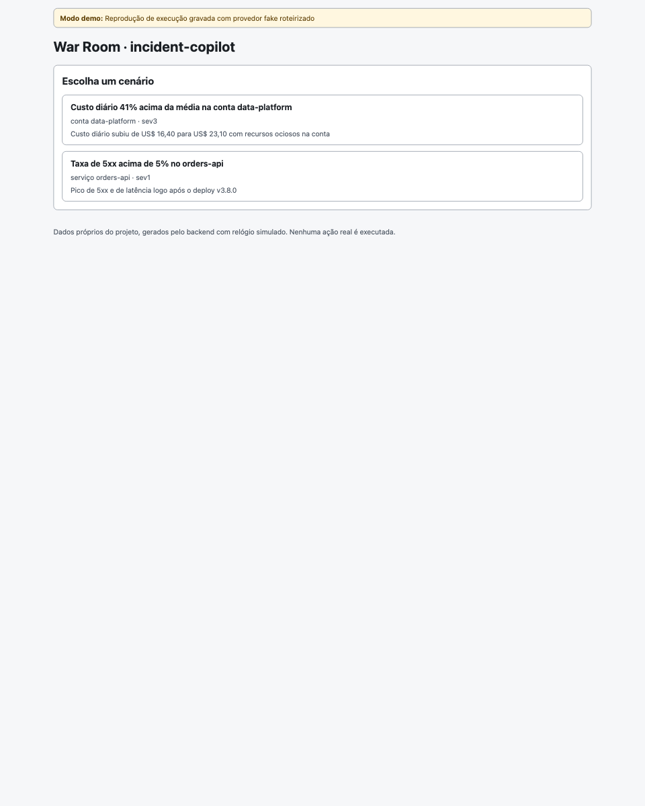
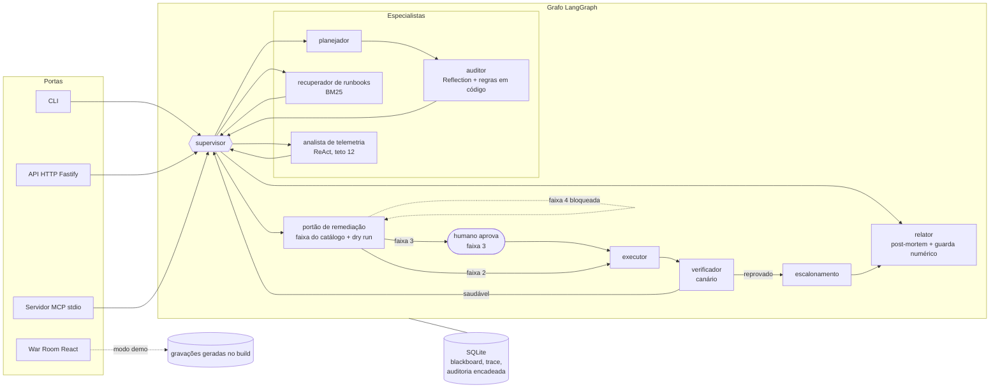
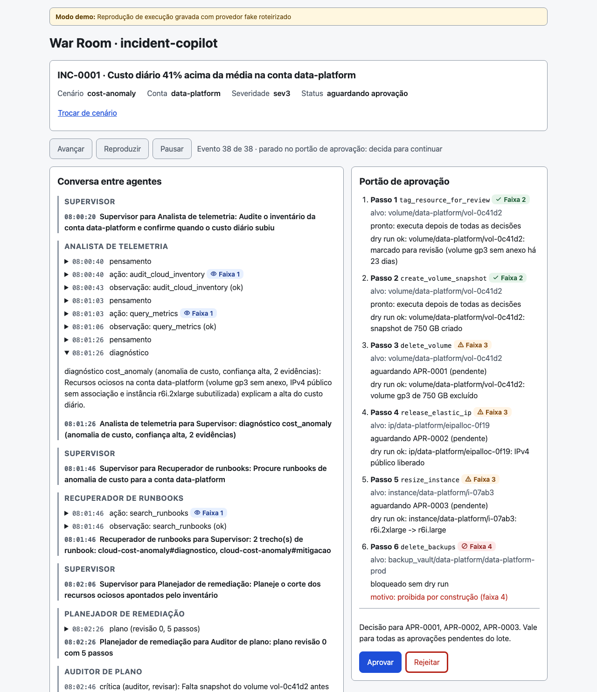

<div align="center">

# incident-copilot

**Copiloto de incidentes multiagente em TypeScript: o modelo propõe; o código e o humano decidem.**

[](https://github.com/flaviorg/incident-copilot/actions/workflows/ci.yml)
[](LICENSE)
[](.nvmrc)
[](tsconfig.json)
[](#testes-e-qualidade)

[**Demo ao vivo da War Room**](https://flaviorg.github.io/incident-copilot/) · [Início rápido](#início-rápido) · [Arquitetura](docs/architecture.md) · [Modelo de ameaças](docs/threat-model.md)

</div>

> **English summary.** Multi-agent incident copilot in TypeScript: a LangGraph supervisor coordinates telemetry, runbook, planning and audit agents; risky actions go through an autonomy matrix with human approval, and forbidden ones never run even when the model proposes them. MTTR and savings are computed from data, not by the LLM. Runs offline with a scripted fake LLM; plug OpenRouter with two env vars (API key and model).

<p align="center">
  <a href="https://flaviorg.github.io/incident-copilot/">
    
  </a>
</p>

<p align="center"><sub>Reprodução de execução gravada com provedor fake roteirizado. Cenário de deploy: a equipe investiga, o portão para no <code>rollback_deployment</code> de faixa 3, o humano aprova e aparecem MTTR e tempo aguardando aprovação.</sub></p>

## Sumário

- [Por que este projeto existe](#por-que-este-projeto-existe)
- [Destaques](#destaques)
- [Arquitetura](#arquitetura)
- [Início rápido](#início-rápido)
- [Uso](#uso): [CLI](#cli) · [API HTTP](#api-http) · [Servidor MCP](#servidor-mcp) · [War Room](#war-room) · [Modelo real](#usando-um-modelo-real-openrouter)
- [Cenários](#cenários)
- [Segurança e guardrails](#segurança-e-guardrails)
- [Números sem invenção](#números-sem-invenção)
- [Testes e qualidade](#testes-e-qualidade)
- [Estrutura de pastas](#estrutura-de-pastas)
- [Aulas do curso aplicadas](#aulas-do-curso-aplicadas)
- [O que mudei em relação à aula](#o-que-mudei-em-relação-à-aula)
- [Limitações conhecidas](#limitações-conhecidas)
- [Licença](#licença)

## Por que este projeto existe

Agentes de LLM já conseguem investigar um incidente e propor uma correção. O problema é confiar neles para executar: um modelo pode errar o diagnóstico, inventar um número no post-mortem ou ser convencido por uma linha de log hostil a apagar backups. Este repositório defende, com testes, uma tese simples: **o modelo propõe; o código e o humano decidem.** O LLM escolhe o próximo especialista, investiga, planeja e redige. A faixa de risco, a aprovação, a execução, os números e a auditoria ficam com código determinístico e com uma pessoa.

## Destaques

- **Equipe de agentes com supervisor** (LangGraph): analista de telemetria com ReAct (teto 12), recuperador de runbooks por BM25, planejador e auditor com Reflection. Cada passagem vira um evento `handoff` persistido.
- **Matriz de Autonomia em quatro faixas.** A faixa vem do catálogo, nunca da saída do LLM. Faixa 3 exige aprovação humana; faixa 4 é proibida por construção e não roda nem quando o modelo a propõe, inclusive por injeção de prompt vinda de log.
- **Números calculados, não escritos.** MTTR, tempo aguardando aprovação e economia saem de funções puras; um guarda numérico rejeita na narrativa número que não sai dos cálculos.
- **Quatro portas, um núcleo:** CLI, API HTTP (Fastify), servidor MCP (stdio) e War Room (React 19, publicada no GitHub Pages).
- **Auditoria só de inserção**, com hash encadeado sobre JSON canônico, verificável pelo cliente.
- **Roda offline**, sem Docker, sem chave e sem rede depois do `npm install`, com um LLM fake roteirizado; o OpenRouter entra com duas variáveis de ambiente.
- **340 testes no backend e 32 na War Room, sem rede**, mais specs SDD com 41 critérios de aceite em EARS.

## Arquitetura



- Toda rota para o escalonamento é decidida por código: o schema da decisão do supervisor não tem essa opção.
- A pausa para aprovação persiste o blackboard no SQLite, e a retomada é uma nova invocação que entra pelo executor.
- `src/contracts` e `src/domain` são puros (sem `node:*` nem camadas externas), e há teste que garante isso.

Diagramas completos (componentes, grafo, máquina de estados da aprovação), tabela de rotas e regra de dependência: [`docs/architecture.md`](docs/architecture.md).

<details>
<summary><strong>Os agentes, um a um</strong></summary>

| Agente | LLM | Ferramentas | Produz |
|---|---|---|---|
| Supervisor | sim (`supervisor.v1`) | nenhuma | próximo especialista e `brief`, validados por uma guarda em código |
| Analista de telemetria | sim (`telemetry-react.v1`), laço ReAct até 12 passos | `query_metrics`, `query_logs`, `list_deploys`, `audit_cloud_inventory` (faixa 1) | diagnóstico com categoria em enum, confiança e evidências |
| Recuperador de runbooks | não | BM25 sobre `runbooks/` | trechos acima do limiar, ou recusa |
| Planejador de remediação | sim (`planner.v1`) | nenhuma (vê o catálogo como texto) | plano de até 8 passos |
| Auditor de plano | sim (`auditor.v1`), mais 5 regras em código como piso | consultas de inventário e deploys feitas pelo código | `approve` ou `revise`, com até 2 revisões |
| Portão de remediação | não | `classifyAction`, dry run, fila de aprovação | ações por faixa |
| Executor | não | mundo simulado, circuit breaker, limitador | ações executadas |
| Verificador | não | canário (`analyzeCanary`), reversão | canário saudável ou reversão |
| Relator | sim (`postmortem.v1`), só para a narrativa de incidente resolvido | métricas puras, guarda numérico, template | post-mortem |
| Escalonamento | não | nenhuma | motivo do escalonamento |

</details>

## Início rápido

Requer Node 24.21 ou mais novo ([`.nvmrc`](.nvmrc)). Sem chave de LLM, sem Docker e sem rede depois do `npm install`.

```bash
git clone https://github.com/flaviorg/incident-copilot.git && cd incident-copilot
npm install
npm run demo
```

A demo força o provedor fake mesmo que o shell tenha `OPENROUTER_API_KEY` (só `--live` usa o modelo real). Saída real, resumida:

```text
$ npm run demo
incident-copilot · demo · provedor: fake roteirizado (sem rede, sem chave)
cenário deploy-5xx-rollback · serviço orders-api · sev1

09:42:30  INC-0001 aberto: "Taxa de 5xx acima de 5% no orders-api" (impacto desde 09:40:30)
09:42:50  supervisor → analista de telemetria: Correlacione 5xx e latência do orders-api com o deploy v3.8.0
(...)
09:44:19  analista de telemetria → supervisor: diagnóstico bad_deploy (deploy com defeito, confiança alta, 3 evidências)
(...)
09:45:39  auditor → supervisor: plano revisão 0 aprovado (5 de 5 regras ok)
(...)
09:46:05    obs   rollback_deployment faixa 3: dry run ok (deployment/orders-api: v3.8.0 -> v3.7.2 (6 réplicas)) → aguardando APR-0001
(...)
09:46:05  portão de remediação → humano: aguardando aprovação de APR-0001
09:49:05  operador demo aprovou APR-0001 (token verificado, valor omitido)
(...)
09:51:41  canário: aprovado (canário saudável: 5xx 0,5% ≤ 5%; P99 205 ms ≤ 270 ms)
09:51:41  verificador → supervisor: canário saudável; incidente mitigado

desfecho: resolvido (canário saudável)

MTTR                    11,2 min        medido (linha do tempo simulada, 09:40:30 → 09:51:41)
  aguardando aprovação  3,0 min         medido (soma das aprovações decididas)
MTTD                    2,0 min         medido
Minutos economizados    33,8 a 83,8     ilustrativo (linha de base sintética de 45 a 95 min)
ROI                     18,9x a 48,2x   ilustrativo (premissas em data/business-assumptions.json)
Custo de LLM            US$ 0,00        medido (12 chamadas, 14014 tokens)

trace 41 eventos (thought 4 · action 10 · observation 10 · plan 1 · critique 2 · answer 2 · handoff 12)
post-mortem: reports/INC-0001-postmortem.md
```

A saída completa dos dois cenários, linha a linha, está em [`docs/demo-output.md`](docs/demo-output.md).

## Uso

### CLI

| Comando | Faz |
|---|---|
| `npm run demo` | Cenário `deploy-5xx-rollback` com o fake, aprovação automática do operador demo |
| `npm run demo -- --reject` | O operador rejeita: o rollback é cancelado junto com o passo que dependia dele, e o incidente termina escalado com `mitigation_rejected` |
| `npm run demo -- --scenario cost-anomaly` | O cenário FinOps, com Reflection e faixa 4 bloqueada |
| `npm run demo -- --json` | Só o objeto final |
| `npm run demo -- --persist` | Grava em `data/incident-copilot.db`; a segunda execução vira `INC-0002` |
| `npm run cli -- demo --live` | A demo com o modelo real ([ver abaixo](#usando-um-modelo-real-openrouter)) |

### API HTTP

`npm start` sobe a API em `127.0.0.1:3000`. Corpo de erro: `{ "error": { "code", "message", "requestId", "issues"? } }`, sem stack. Toda resposta traz `X-Request-Id`.

| Rota | Faz |
|---|---|
| `POST /incidents` | abre e executa a equipe até `awaiting_approval`, `resolved` ou `escalated` |
| `GET /incidents`, `GET /incidents/:id` | lista com filtro em SQL; visão completa do incidente |
| `GET /incidents/:id/trace`, `/audit`, `/postmortem` | trace, trilha de auditoria verificável e post-mortem (Markdown ou JSON) |
| `GET /approvals`, `POST /approvals/:id/decision` | fila de aprovações; decisão com `X-Approval-Token`, que retoma o incidente |
| `GET /health`, `GET /scenarios`, `GET /stats` | saúde, cenários e estatísticas em SQL (MTTR P50 e P95, faixas, guardas, uso do LLM) |

<details>
<summary><strong>Sequência real com <code>curl</code></strong> (abrir, errar o token, decisão ambígua, aprovar)</summary>

Com banco novo e um token local de 16 caracteres ou mais exportado no shell como `APPROVAL_TOKEN` (o valor não aparece em nenhuma saída):

```text
$ curl -s -X POST localhost:3000/incidents -H 'content-type: application/json' -d '{"scenarioId":"deploy-5xx-rollback"}' | jq -c '{id: .incident.id, status: .incident.status, pendentes: [.approvals[] | select(.status=="pending") | .id]}'
{"id":"INC-0001","status":"awaiting_approval","pendentes":["APR-0001"]}

$ curl -s -X POST localhost:3000/approvals/APR-0001/decision -H 'content-type: application/json' -H 'X-Approval-Token: errado-errado-errado' -d '{"decision":"approve","approver":"ana"}' | jq -c .error
{"code":"invalid_token","message":"token de aprovação inválido ou ausente","requestId":"af8556c4-46a9-49aa-85c2-a28c89248c29"}

$ curl -s -X POST localhost:3000/approvals/APR-0001/decision -H 'content-type: application/json' -H "X-Approval-Token: $APPROVAL_TOKEN" -d '{"text":"sim, mas espera","approver":"ana"}' | jq -c .error.code
"ambiguous_decision"

$ curl -s -X POST localhost:3000/approvals/APR-0001/decision -H 'content-type: application/json' -H "X-Approval-Token: $APPROVAL_TOKEN" -d '{"decision":"approve","approver":"ana"}' | jq -c '.incident.incident.status'
"resolved"

$ curl -s 'localhost:3000/incidents/INC-0001/postmortem?format=json' | jq -c .numericGuard
{"passed":false,"rejectedNumbers":["11,2"],"usedTemplate":true}
```

O último comando mostra o [guarda numérico](#números-sem-invenção) funcionando: com o relógio do sistema, a narrativa roteirizada cita "11,2" (o MTTR da linha do tempo simulada), o MTTR real foi outro (cerca de 2 min neste exemplo), e o post-mortem saiu pelo template determinístico.

</details>

Todas as rotas com seus códigos de erro e a sequência completa (`/health`, `/stats`, post-mortem em Markdown): [`docs/http-api.md`](docs/http-api.md).

### Servidor MCP

`npm run mcp` sobe o servidor stdio `incident-copilot` sobre o mesmo banco da API. O stdout só leva JSON-RPC; todo log vai para stderr. Para ligar um cliente MCP, use `node` direto, como nas configurações do repositório, ou `npm run -s mcp`: sem o `-s`, o próprio npm escreve duas linhas de cabeçalho no stdout antes do JSON-RPC.

| Tool | Faz |
|---|---|
| `list_incidents` | incidentes recentes e status, com filtro |
| `get_incident` | visão do incidente e os últimos eventos do trace |
| `propose_remediation` | propõe uma ação para um incidente `awaiting_approval`: faixa 2 entra no lote pronto, faixa 3 vai para a fila humana, faixa 4 e tipo desconhecido são recusados com auditoria |

**Nenhuma tool aprova nem executa.** A proposta roda junto com o lote, depois da decisão humana pela API. Para inspecionar: `npm run mcp:inspect`, que baixa o MCP Inspector com `npx` na primeira vez.

<details>
<summary><strong>Configuração do cliente</strong> (VS Code e Cursor)</summary>

VS Code ([`.vscode/mcp.json`](.vscode/mcp.json), já no repositório):

```json
{
  "servers": {
    "incident-copilot": {
      "type": "stdio",
      "command": "node",
      "args": ["--env-file-if-exists=.env", "src/mcp/server.ts"]
    }
  }
}
```

O Cursor usa o mesmo conteúdo com a chave `mcpServers` ([`.cursor/mcp.json`](.cursor/mcp.json)).

</details>

### War Room

**Ao vivo:** [flaviorg.github.io/incident-copilot](https://flaviorg.github.io/incident-copilot/)

A War Room ([`web/`](web/)) é uma página estática em React 19 e Vite 8 que reproduz gravações geradas pelo próprio backend (`npm run demo:record`), sem precisar de API: conversa entre agentes com handoffs, portão de aprovação com selo de faixa (texto, ícone e cor) e os ramos aprovar e rejeitar, cartões de números e post-mortem com o selo do guarda numérico.

```bash
npm run web:install   # uma vez: pacote aninhado, instalação própria
npm run web:demo      # gera as gravações e sobe o Vite
```

<p align="center">
  
</p>
<p align="center"><sub>O portão do cenário de custo: três aprovações de faixa 3 pendentes e o <code>delete_backups</code> de faixa 4 bloqueado sem dry run. Como as mídias foram feitas: <a href="docs/media/README.md"><code>docs/media/README.md</code></a>.</sub></p>

- **Acessibilidade.** axe sem violações nas telas principais, diálogo com foco preso e Escape, faixa por texto e ícone, foco do teclado acompanhando a reprodução e uma coluna em tela estreita. Checklist e evidências em [`docs/accessibility.md`](docs/accessibility.md).
- **Design tokens.** Cores, espaçamento e tipografia só em [`web/src/styles/tokens.css`](web/src/styles/tokens.css), com temas claro e escuro. `npm run check:tokens` falha com cor literal fora dele, e um teste prova contraste de pelo menos 4,5:1 em todos os pares declarados.
- **Publicação.** O workflow manual "Pages (War Room)" ([`.github/workflows/pages.yml`](.github/workflows/pages.yml)) faz o build com `VITE_BASE=/incident-copilot/` e publica `web/dist`. Nada é publicado sem alguém disparar o workflow.

### Usando um modelo real (OpenRouter)

1. Copie [`.env.example`](.env.example) para `.env` e preencha `OPENROUTER_API_KEY` e `OPENROUTER_MODEL`. O modelo precisa suportar saída estruturada. `OPENROUTER_MODEL_FALLBACK` é opcional. O `.env` está no `.gitignore`, e `check:secrets` (com o pre-commit) não o varre enquanto ele não for rastreado pelo Git.
2. Com a chave definida e `LLM_PROVIDER` vazio, a API, o MCP e a CLI usam o OpenRouter. `LLM_PROVIDER=fake` força o fake mesmo com chave.
3. Rode:
   - `npm run test:live`: roda o cenário de deploy contra o modelo real e confere só estrutura (categoria no enum, passos no catálogo ou bloqueados, guarda numérico aprovado ou template usado). Sem chave, o teste é pulado.
   - `npm run cli -- demo --live`: a demo de terminal com o modelo real. O script `cli` lê o `.env`; o script `demo` não lê, de propósito, para a demo padrão nunca pegar uma chave sem querer. Sem `OPENROUTER_API_KEY` e `OPENROUTER_MODEL` (ou com `LLM_PROVIDER=fake`), `--live` termina com erro e código 1 em vez de cair no fake.

Qualquer endpoint compatível com a API da OpenAI serve (`LLM_BASE_URL`). Cada chamada fica registrada em `llm_calls` com tokens, custo estimado ([`data/model-prices.json`](data/model-prices.json)), latência e tipo de erro.

## Cenários

Os dados são do projeto, gerados por especificação determinística (séries com PRNG semeado). As aulas inspiram o mecanismo, não os números.

| Cenário | Situação | Diagnóstico | Plano final (faixa) | O que mostra |
|---|---|---|---|---|
| `deploy-5xx-rollback` | `orders-api`, sev1. 5xx de 0,4% para quase 10% logo depois do deploy `v3.8.0`; `TypeError` em `PriceFormatter.format` só nessa versão | `bad_deploy`, confiança alta | `add_incident_note` (2), `rollback_deployment` para `v3.7.2` (3), `block_image_tag` (2, depende do rollback) | Caminho feliz, aprovação humana, canário saudável, MTTR. O runbook distrator fica abaixo no ranking |
| `cost-anomaly` | conta `data-platform`, sev3. Custo diário 41% acima da média; volume `gp3` sem anexo, IPv4 ocioso, instância com 3,1% de CPU | `cost_anomaly`, confiança alta | Revisão 0 reprovada por `snapshot_before_delete`. Revisão 1: `tag_resource_for_review` (2), `create_volume_snapshot` (2), `delete_volume` (3), `release_elastic_ip` (3), `resize_instance` (3) e `delete_backups` (4, bloqueado) | Reflection; faixa 4 barrada mesmo num plano aprovado pelo auditor; economia mensal de US$ 339,59 (60,00 + 3,65 + 275,94) |

## Segurança e guardrails

Toda entrada externa é tratada como não confiável, inclusive a saída do modelo. O [modelo de ameaças](docs/threat-model.md) tem uma linha por entrada (saída do LLM, logs e runbooks no prompt, comentário e texto da decisão, `X-Request-Id`, parâmetros do MCP, token), com a defesa e o teste que a prova.

**Injeção indireta por log** ([`tests/e2e/injection.e2e.test.ts`](tests/e2e/injection.e2e.test.ts)): uma linha de log hostil manda o agente apagar backups; o teste afirma que o texto chega ao prompt do analista e que o planejador roteirizado inclui `delete_backups`. Mesmo assim, o passo termina `blocked_forbidden`, sem dry run, com auditoria e `critique` do portão, e os passos legítimos seguem. A defesa não está no prompt: está no catálogo, que nega por padrão, e na faixa 4, que não tem executor.

| Faixa | Comportamento |
|---|---|
| 1 | Só leitura, roda livre |
| 2 | Roda e registra |
| 3 | Exige aprovação humana com token |
| 4 | Proibida por construção: o tipo nem existe no registro de executores |

Catálogo completo de ações e regras de contexto: [`docs/autonomy-matrix.md`](docs/autonomy-matrix.md) (gerado do código).

<details>
<summary><strong>Todos os guardrails e o teste que prova cada um</strong></summary>

| Guardrail | Como funciona | Teste que prova |
|---|---|---|
| Matriz de Autonomia | Faixa do catálogo; regras de contexto só sobem. Faixa 1 lê; 2 roda e registra; 3 exige aprovação humana; 4 é proibida por construção (o tipo nem existe no registro de executores) | `autonomy.unit.test.ts`, `scenarios.e2e.test.ts` |
| Guarda do supervisor | Escolha sem pré-condição vira `critique` (`coerced`) e segue a rota canônica | `supervisor-guard.unit.test.ts`, `team.e2e.test.ts` |
| Auditor com piso em código | O LLM pode endurecer o veredito, nunca afrouxar; a sobrescrita fica no campo `overridden` do `critique`, que o `/stats` conta | `auditor-rules.unit.test.ts`, `nodes-planning.unit.test.ts`, `stats.unit.test.ts` |
| Tetos | ReAct 12, rodadas do analista 2, equipe 8, recursão 25, revisões 2, passos por plano 8, observação 600 caracteres; `RUN_TIMEOUT_MS` conferido também pelo relógio a cada superstep | `telemetry.e2e.test.ts`, `team.e2e.test.ts`, `tools.unit.test.ts` (observação), `resilience.e2e.test.ts` (timeout) |
| Aprovação | Máquina de estados pura; texto livre só com termos exatos; expiração projetada na leitura e materializada na decisão; rejeição cancela dependentes; decisão recusada (409 `incident_not_accepting`) enquanto a execução do incidente ainda roda | `approval-machine.unit.test.ts`, `parse-decision.unit.test.ts`, `gate.e2e.test.ts` |
| Token de aprovação | Comparação em tempo constante; 5 erros em 10 min bloqueiam 10 min (bloqueio global do processo, ver limitações); nunca ecoado | `guards.unit.test.ts`, `http.e2e.test.ts` |
| Segredos | `redactSecrets` em toda saída; varredura das 7 superfícies; `check:secrets` no pre-commit e no CI (o `.env` local fica de fora enquanto não for rastreado pelo Git) | `secrets.e2e.test.ts`, `check-secrets.unit.test.ts` |
| Circuit breaker e rate limit | 3 falhas abrem por 300 s; 5 execuções por minuto; mesma ação no mesmo alvo 1 vez em 10 min | `guards.unit.test.ts`, `gate.e2e.test.ts` |
| Canário | Limiar em código; reprovado reverte as ações reversíveis em ordem inversa | `canary.unit.test.ts`, `gate.e2e.test.ts` |
| Auditoria | Só inserção (gatilhos no banco), hash encadeado sobre JSON canônico, uma cadeia por incidente desde o hash gênese, ordem por `seq INTEGER PRIMARY KEY`; a API devolve `prevHash` e `hash` para o cliente recalcular a cadeia | `store-audit.unit.test.ts`, `http.e2e.test.ts` |

</details>

## Números sem invenção

Os números de destaque são **MTTR** e **tempo aguardando aprovação**; no cenário FinOps, também a **economia mensal**. Todos são calculados por funções puras ([`src/domain/metrics/incident-metrics.ts`](src/domain/metrics/incident-metrics.ts)) sobre a linha do tempo, as séries e as premissas. Os valores vêm dos arquivos golden ([`tests/golden/`](tests/golden/)), que a suíte confere a cada execução:

| Cenário (ramo aprovado) | MTTR | Aguardando aprovação | Economia mensal | Minutos economizados (ilustrativo) | ROI (ilustrativo) |
|---|---|---|---|---|---|
| `deploy-5xx-rollback` | **11,2 min** (09:40:30 → 09:51:41) | **3,0 min** | não se aplica | 33,8 a 83,8 | 18,9x a 48,2x |
| `cost-anomaly` | **19,9 min** | **18,0 min** (soma das 3 aprovações) | **US$ 339,59** | 25,1 a 75,1 | 12,8x a 17,8x |

Minutos economizados e ROI são **ilustrativos, sobre linha de base sintética**: comparam o MTTR com uma linha de base de 45 a 95 min que **não vem de histórico real** e está em [`data/business-assumptions.json`](data/business-assumptions.json) para ser trocada pelo histórico da sua operação. Cada valor carrega um rótulo: `measured` (medido), `assumption` (premissa) ou `derived` (derivado).

<details>
<summary><strong>Relógio simulado e guarda numérico</strong></summary>

**MTTR da demo.** Vem do relógio simulado: 20 s por chamada de LLM, 3 s por ferramenta, 2 s por dry run, a duração do catálogo por execução e 180 s por aprovação. Com modelo real e relógio do sistema, os números mudam.

**ROI.** Usa premissas declaradas em `data/business-assumptions.json` (custo por hora de engenharia, receita por minuto, custo mensal do copiloto).

**Guarda numérico.** O LLM só redige a narrativa do post-mortem, a partir de fatos já formatados. O guarda extrai cada número escrito com algarismos e rejeita o que não corresponde a um valor calculado, da linha do tempo ou das evidências. Ele ignora identificadores (versões, horários ISO, ids de recurso). A forma equivalente (9,4% e 0,094) só vale para frações medidas, como a fração de impacto e o pico da taxa de erro, e para números que já aparecem com "%" nas evidências: uma contagem 3 ou a linha de base 45 não autorizam "300%" nem "45%". Se rejeitar, a narrativa vai fora e entra o template determinístico, com `critique` listando os números. Número por extenso ("três minutos") não é extraído; ver limitações.

</details>

## Testes e qualidade

| Camada | Ferramenta | Rede | Cobre |
|---|---|---|---|
| Unidade | `node:test`, `tests/unit/*.unit.test.ts` | proibida | domínio puro, store em `:memory:`, fake, resiliência, redação, contratos, suposições de API, specs, varredura de segredos |
| Ponta a ponta | `node:test`, `tests/e2e/*.e2e.test.ts` | proibida | grafo por cenário com asserção no banco, HTTP por `app.inject`, MCP com cliente real, CLI como processo filho, gravações |
| War Room | Vitest, jsdom, Testing Library, axe-core | proibida | replay, fonte demo, diálogo, acessibilidade, contraste |
| Ao vivo (opcional) | `node:test`, `tests/live/*.live.ts` | OpenRouter | estrutura com modelo real; pulado sem chave |

```bash
npm test             # backend inteiro, sem rede
npm run test:unit    # só unitários (o pre-commit)
npm run web:test     # War Room
npm run verify       # o que o CI roda: typecheck, testes, testes e build da web, check:tokens, check:secrets
```

Contagem atual: **340 testes no backend**, todos passando (262 unitários em 40 arquivos e 78 de ponta a ponta em 11 arquivos), e **32 na War Room**, em 6 arquivos. O teste ao vivo é pulado sem chave.

- **Sem rede.** `fetch` é substituído por uma função que lança erro, no processo de teste e nos filhos (CLI e MCP); um teste sobe um filho pelos mesmos helpers e confere o bloqueio lá dentro.
- **Fake estrito.** Os testes de cenário afirmam que todos os turnos do roteiro foram consumidos e que as métricas batem com os golden.
- **Sem comparar narrativa.** Nenhum teste compara texto livre do LLM por igualdade.

<details>
<summary><strong>O que o provedor fake prova e o que não prova</strong></summary>

O provedor padrão é um **fake roteirizado**: cada resposta do "modelo" está escrita numa fixture (`fixtures/llm/<cenário>.json`), indexada por versão do prompt e por uma condição pequena sobre a entrada. Chamada sem turno roteirizado ou prompt alterado sem atualizar a fixture quebra o teste. Detalhes em [`docs/fake-provider.md`](docs/fake-provider.md).

**Prova:**

- o fluxo do grafo, as rotas por código, os tetos e o escalonamento;
- que a faixa vem do catálogo e que a faixa 4 nunca executa;
- a máquina de aprovação, o token, a redação e a auditoria;
- que os números saem de funções puras e que o guarda rejeita número inventado;
- os caminhos de falha do LLM (timeout, erro do servidor, saída inválida) com retry, fallback, 503 e 504.

**Não prova:**

- **Qualidade do modelo.** Um LLM real pode errar o diagnóstico ou montar um plano pior. As guardas e o portão limitam o dano, mas não garantem acerto.
- **Reflection espontâneo.** Na demo `cost-anomaly`, o auditor devolve o plano porque a **regra em código** `snapshot_before_delete` reprova a revisão 0. O texto do feedback é roteirizado.
- **Tempos e custos reais.** O relógio é simulado e o fake custa US$ 0,00.

A War Room diz isso em todas as telas: "Reprodução de execução gravada com provedor fake roteirizado".

</details>

<details>
<summary><strong>Tempos medidos num clone limpo</strong></summary>

Medidos em 2026-10-04, sem `.env`, depois de apagar tudo o que é gerado (o equivalente a um clone limpo), num Apple M5 Pro com Node 24.21.0 e npm 11.19.0:

| Critério | Comando | Tempo | Meta |
|---|---|---|---|
| S1 | `rm -rf node_modules web/node_modules web/dist web/public/demo reports` e depois `npm ci && npm --prefix web ci && npm run verify` | 17,7 s (real), código 0 | menos de 3 min |
| S2 | `npm run demo` com uma `OPENROUTER_API_KEY` falsa no ambiente | 0,455 s, código 0, cabeçalho "provedor: fake roteirizado" | menos de 10 s |

O `npm ci` levou cerca de 1 s na raiz e 0,6 s em `web/`, porque o cache do npm na máquina já tinha os pacotes. Numa máquina sem esse cache, o download entra na conta e o tempo do S1 depende da rede.

</details>

### Processo de desenvolvimento

- **SDD.** [`specs/constitution.md`](specs/constitution.md) traz os princípios inegociáveis. Cada marco tem uma spec em `specs/NNN-*/spec.md` (de [`001-store-and-tools`](specs/001-store-and-tools/spec.md) a [`007-war-room`](specs/007-war-room/spec.md)), com contexto, escopo, non-goals e critérios de aceite em EARS ("Quando...", "Se..., então...", "O sistema deve..."). Os 41 critérios aparecem uma vez cada, e um teste confere.
- **TDD.** Regra do projeto: o teste vem antes e é visto falhando. Houve exceções pontuais durante a construção, e elas ficaram registradas nas notas de desenvolvimento.
- **[`AGENTS.md`](AGENTS.md).** Instruções curtas e factuais para agentes de código: comandos, mapa de pastas, regras e como acrescentar uma ação ao catálogo.
- **CI.** [`.github/workflows/ci.yml`](.github/workflows/ci.yml) roda typecheck do backend e da web, testes do backend e da web, build da web, `check:tokens` e `check:secrets`, sem nenhum segredo configurado.
- **Pre-commit.** [`.githooks/pre-commit`](.githooks/pre-commit) roda typecheck, testes unitários e `check:secrets`. Instale com `npm run setup:hooks`.
- **Post-mortems da construção.** [`docs/incidents/`](docs/incidents/) guarda post-mortems sem culpa de falhas reais da construção, como o fake que consumia o roteiro por processo e o foco perdido no portão. Nenhum é inventado.
- **APIs conferidas.** [`docs/api-notes.md`](docs/api-notes.md) registra as assinaturas conferidas nos `.d.ts` antes do uso; as suposições de comportamento viram testes em `api-assumptions.unit.test.ts`.

## Estrutura de pastas

```text
incident-copilot/
├── src/
│   ├── contracts/      # schemas Zod e tipos compartilhados com a War Room (sem lógica, sem I/O)
│   ├── domain/         # regras puras: faixas, aprovação, auditor, guardas, canário, métricas, BM25
│   ├── infra/          # SQLite, cenários, runbooks, mundo simulado, relógio, ids, logger, redação
│   ├── llm/            # provedores (fake e OpenRouter) e resiliência
│   ├── prompts/v1/     # prompts versionados
│   ├── tools/          # ferramentas de faixa 1 do analista (métricas, logs, deploys, inventário)
│   ├── graph/          # grafo LangGraph, rotas e nós (um por arquivo, criados por fábrica)
│   ├── app/            # serviços de aplicação e container.ts
│   ├── http/           # porta: API Fastify
│   ├── mcp/            # porta: servidor MCP stdio
│   ├── cli/            # porta: CLI (subcomandos)
│   ├── cli.ts          # entrada da CLI
│   ├── index.ts        # entrada da API
│   └── config.ts       # configuração validada na partida
├── web/                # War Room (React 19 + Vite 8, pacote aninhado)
├── fixtures/           # cenários com dados próprios e roteiros do fake
├── runbooks/           # runbooks em Markdown indexados por BM25
├── data/               # premissas de negócio e tabelas de preço
├── tests/              # unit, e2e, golden, fixtures/llm, helpers, live
├── specs/              # constitution e specs SDD por marco
├── docs/               # arquitetura, ameaças, matriz, fake, acessibilidade, post-mortems
└── scripts/            # check:tokens, check:secrets, rehash de fixtures, geração de docs
```

## Aulas do curso aplicadas

Projeto de portfólio do curso de IA da UNIPDS. Só ID e tema, sem trechos de transcrição, slides ou material autoral. O mapa aula a aula, com o arquivo e a prática de cada uma, está em [`docs/course-mapping.md`](docs/course-mapping.md).

<details>
<summary><strong>Tabela de aulas por parte do projeto</strong></summary>

| Parte do projeto | Aulas | Tema |
|---|---|---|
| Supervisor, blackboard e handoffs | 221528 | Multiagentes com supervisor |
| `StateGraph`, rotas condicionais, fábricas com DI, estado em Zod | 200955, 200956, 200957, 200958, 200959, 200963, 221524 | Pipeline LangGraph; prompt chaining; fallback de modelo |
| ReAct do analista com teto 12 | 221508, 221511, 213411, 213412, 213413 | Padrões de raciocínio; ReAct; troubleshooting com ReAct |
| Auditor com Reflection e trace tipado | 221512, 221513 | Plan-and-Execute; Reflection e benchmark |
| Erro como observação | 221517 | Ferramenta resiliente a provedor externo |
| Saída estruturada e "confio, mas confiro" | 200960, 200961, 200962 | Prompt chaining e JSON prompts |
| Limite de recursão e testes sem LLM | 200978 | RAG avançado com Text-to-Cypher |
| Contrato HTTP e timeout de 180 s | 221514 | API que também é agente |
| Config que falha cedo, Fastify, `app.inject` | 200953, 200954 | Gateway de modelos |
| `node:sqlite`, CHECK, `:memory:` | 221515, 221516 | Integração com banco |
| MCP como segunda porta, logs em stderr | 221518, 203479, 203482, 203483, 203484, 203485 | Agente via MCP; MCP do zero com testes; customers-mcp |
| Agente sem credencial de ação crítica | 198071, 210748 | Permissões mínimas; agente que entrega por PR |
| Prompt injection | 200969, 200970, 200971, 200972 | Prompt injection, hijacking e guardrails |
| Observabilidade e Matriz de Autonomia | 221525 | Estratégias de observabilidade |
| War Room e GitHub Pages | 221526, 221527 | War Room; publicação no Pages |
| SDD, constitution, EARS, pre-commit, instruções curtas | 221503, 221504, 221505, 221506, 221507, 203477 | Agente de código; SDD do zero; guardrails; agents e instructions |
| Non-goals na spec | 210745 | OpenSpec com non-goals |
| Design tokens, acessibilidade, layout estreito | 210738, 210739, 210742 | Tokens; modal acessível; contraste e layout |
| Mock primeiro, Zod no cliente, contrato compartilhado | 210764, 210765, 210744 | BragBot; CFP Platform |
| Canário | 213409, 213410 | Agentes para Kubernetes |
| ChatOps com humano no laço | 213417, 213418, 213419 | ChatOps e governança |
| FinOps | 213428, 213429 | FinOps (inspiração) |
| Runbooks e post-mortem | 213430, 213431 | RAG de runbooks e post-mortem |
| Remediação segura | 213437, 213438 | Auto-remediação com guardrails |
| Projeto integrador e valor | 213439, 213440, 213441 | Nexus Manager |
| Automação determinística para ação destrutiva | 213495 | Supply chain |
| Portfólio com incidentes reais | 213487, 213488, 213489, 198027 | IA em DevOps; critério de replicar com outro domínio |
| Prompt como configuração versionada | 198069, 198082 | Prompt engineering; RAG |

</details>

## O que mudei em relação à aula

As aulas do módulo 06 usam Python e CrewAI; aqui o mecanismo foi reimplementado em TypeScript e LangGraph, sobre dados próprios, e cada atalho didático virou código que dá para testar.

| Na aula | Neste projeto |
|---|---|
| Python e CrewAI (módulo 06) | TypeScript e LangGraph: o trio de portfólio é TypeScript, e o ambiente tem Python 3.9 |
| Dados dos labs | Dados próprios: outro serviço, outras métricas, outro inventário e outra tabela de preços, mantendo o mecanismo |
| Express (221514) | Fastify, por causa do `app.inject` e da convenção dos módulos 02 e 03 |
| `createReactAgent` com tool calling nativo (221511) | ReAct com saída estruturada num laço dentro do nó: funciona com modelos sem tool calling, o fake roteiriza cada passo e o laço não consome o limite de recursão do grafo |
| Senha de aprovação no código e devolvida na resposta (213418) | Token de ambiente, com comparação em tempo constante e redação em todas as saídas, com teste |
| Aprovação "sim/não" interpretada pelo agente (213437, 213438) | Máquina de estados em código com lista fechada de termos |
| ROI escrito pelo LLM (213441) | Cálculo puro, com ROI só como faixa ilustrativa sobre premissas declaradas e guarda numérico na narrativa |
| Canário que não conseguia falhar (213410) | Função pura, com cenário que reprova e reversão automática |
| Runbook escolhido por parâmetro do prompt (213430) | BM25 por seção, com recusa abaixo do limiar |
| Reflection só por LLM (221513) | Reflection com piso de regras em código |
| War Room com túnel temporário (221527) | Modo demo estático, com gravações e dois ramos |
| Tailwind (210738) | CSS com design tokens semânticos |
| `zod/v3` (221516) | Zod 4, com os enums do SQL gerados do mesmo schema |
| Filtro em memória (203484) | Filtro em SQL |
| Testes contra LLM real (200954, 200978) | Suíte sem rede, com fake roteirizado e guarda de `fetch` |
| Checkpointer do LangGraph | Blackboard persistido em `node:sqlite`, com retomada explícita |

<details>
<summary><strong>Padrões do módulo 06 reimplementados em TypeScript</strong></summary>

| No curso (Python e CrewAI) | No projeto (TypeScript e LangGraph) |
|---|---|
| `Agent(role, goal, backstory)` | Fábrica de nó (`createXNode(deps)`) e prompt versionado |
| `Crew` sequencial | Arestas fixas do `StateGraph` (planejador para auditor) |
| `manager_agent` com delegação | Nó supervisor com `SupervisorDecisionSchema` e guarda de pré-condições em código |
| Tools simuladas por condicionais | Ferramentas com parâmetros Zod sobre séries sintéticas determinísticas |
| Runbook consultado por parâmetro de serviço | BM25 sobre seções de runbooks com frontmatter, limiar normalizado e recusa |
| Senha de aprovação no código | Token em `APPROVAL_TOKEN`, comparação em tempo constante, redação em todas as saídas |
| Aprovação "sim/não" interpretada pelo agente | Máquina de estados em código com lista fechada de termos |
| Canário que não falhava | Função pura com cenário de métricas ruins e reversão automática |
| ROI escrito pelo gerente | Funções puras de métricas, ROI como faixa ilustrativa e guarda numérico |
| Log com hash da execução | `runId`, `requestId`, trace persistido e auditoria encadeada por hash |

</details>

## Limitações conhecidas

O ponto mais importante primeiro: **o provedor fake prova a mecânica, não a qualidade do modelo.** Toda a demo e toda a suíte rodam com respostas roteirizadas. Com um LLM real, o diagnóstico e o plano podem ser piores; as guardas e o portão limitam o dano, mas não garantem acerto. A qualidade do modelo só aparece com `npm run test:live` e uso real.

- **Mundo simulado.** Nenhuma ação toca infraestrutura real.
- **Relógio simulado na demo.** O MTTR da demo é a linha do tempo simulada, não um tempo medido.
- **Narrativa roteirizada.** Com relógio do sistema, os números da narrativa do fake não batem e o post-mortem sai pelo template (o guarda numérico funcionando, mas sem narrativa).
- **Proteções em memória.** Circuit breaker, limitador de execuções e bloqueio por tentativas de token valem por processo; reiniciar a API zera os três.
- **Bloqueio de token global.** As 5 tentativas erradas (ou sem token) contam para o processo inteiro, não por cliente: quem errar 5 vezes em 10 min trava as decisões de todos, inclusive do operador com o token certo, por 10 min. A API só escuta em `127.0.0.1`; o risco está aceito no [modelo de ameaças](docs/threat-model.md).
- **Token único.** Não há usuários nem papéis.
- **Números por extenso.** O guarda numérico só extrai algarismos; "três minutos" numa narrativa passa sem conferência.
- **Expiração sem agendador.** Um incidente cujo operador nunca tenta decidir continua `awaiting_approval` no banco, embora as leituras mostrem a aprovação como `expired`.
- **Execução interrompida pela queda do processo.** Decisões só são aceitas quando nenhuma execução do incidente está em andamento (linha de `runs` sem fim). Se o processo cair no meio de uma execução, essa linha fica aberta e o incidente passa a recusar decisões com 409 `incident_not_accepting`; não há comando de recuperação na v1.
- **Tempo aguardando aprovação** é a soma das aprovações decididas (18,0 min no cenário de custo), não o tempo de relógio em que o incidente ficou parado (9 min).

<details>
<summary><strong>Trabalho futuro (v2)</strong></summary>

1. Cenário `memory-leak-saturation`, com previsão de saturação por regressão linear e consulta de traces.
2. Cenário de imagem com CVE crítica e triagem de vulnerabilidades, com dados próprios.
3. Modo ao vivo da War Room contra a API local: diálogo de configuração, campo de token `type="password"` e CORS restrito à origem da War Room, suportado só em `localhost`.
4. `Tabs`, `Sparkline`, tabela de trace filtrável e teste de `prefers-reduced-motion` na War Room.
5. Resource `incident-copilot://autonomy-matrix` e prompt `triage-incident` no MCP.
6. `/stats` com latência de execução P50 e P95 e detalhamento por modelo e por cenário.
7. Regra de subida de faixa por custo estimado da ação.
8. Golden do post-mortem em Markdown.
9. Agendador que materializa a expiração de aprovação sem depender de uma tentativa de decisão.
10. Comandos `fixtures check` e `postmortem` na CLI.
11. Ações do catálogo sem uso nos cenários da v1 (`scale_out`, `rolling_restart`, `silence_alert`, `update_resource_limits`, `rebuild_and_redeploy_image`, `create_ticket`).

</details>

## Licença

[MIT](LICENSE), Copyright (c) 2026 Flavio Gouveia.
