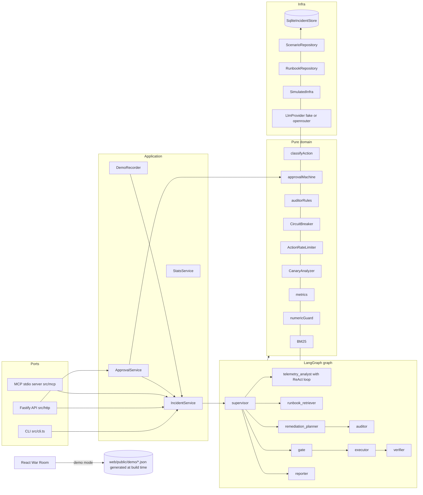
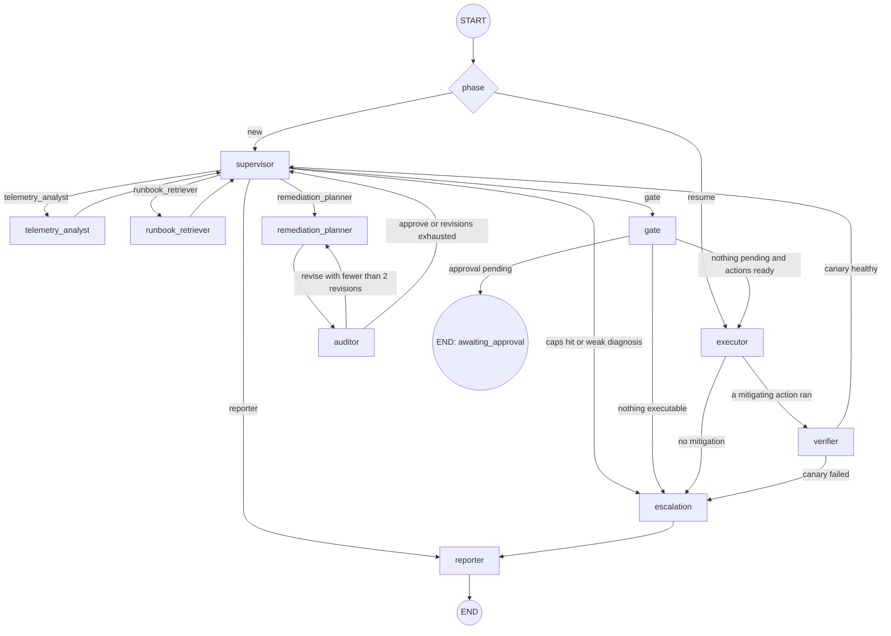
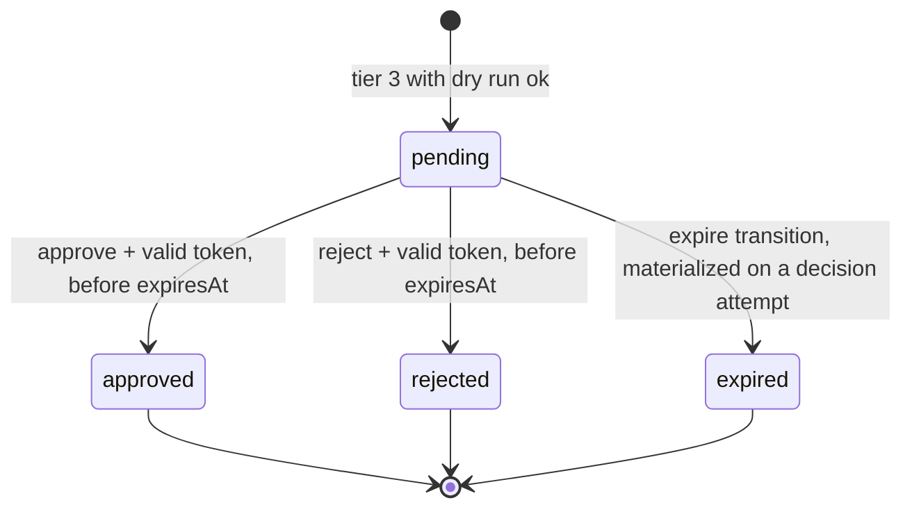

# Architecture

`incident-copilot` has a single rule: **the model proposes; code and the human decide.** The LLM picks the next specialist, investigates, builds the plan, may request a revision, and drafts the post-mortem. Deterministic code does the rest:

- classifies the risk of each step;
- decides what runs on its own;
- enforces the plan's quality floor;
- holds the approval;
- computes the numbers;
- writes the audit log.

This document collects the three design diagrams (components, graph, and approval state machine), the routing table, and the dependency rule between layers.

## Components

Everything is wired by `createContainer` (`src/app/container.ts`), the single source used by the API, the MCP server, the CLI, and the tests. Tests use `createTestContainer` (`tests/helpers/container.ts`), with an explicit `:memory:` database, simulated clock, and fake provider.

## Graph

How the graph works:

- **Node names.** LangGraph rejects a node named after a state key, and `supervisor` and `escalation` are blackboard keys. So the nodes are registered as `supervisor_agent` and `escalation_node`. Routing functions return the logical name, and each edge's `pathMap` translates it (`GRAPH_NODE_ID` in `src/graph/routing.ts`). The trace shows the logical names.
- **ReAct loop inside the node.** `telemetry_analyst` runs its loop in a `for` of up to 12 steps. No step counts as a graph superstep: a subgraph would inherit the parent's `recursionLimit` and blow up before step 12. This behavior is pinned in `tests/unit/api-assumptions.unit.test.ts`.
- **Pause and resume.** The first invocation stops at `awaiting_approval` or finishes. Resuming is a new invocation with the blackboard loaded from the database and `phase: "resume"`, entering through the executor. There is no checkpointer.
- **Caps.** Each invocation uses `graph.stream(..., { streamMode: "values", recursionLimit: 25, signal })`, with `signal = AbortSignal.timeout(RUN_TIMEOUT_MS)`. `IncidentService` keeps the last emitted state. On `GraphRecursionError` or timeout, it calls the `escalation` and `reporter` node functions directly, preserving the diagnosis and plan obtained so far.
  - The `AbortSignal.timeout` timer only fires when the event loop runs timers. A run with no I/O (fake without `delayMs`, synchronous SQLite, `await` on microtasks) never yields, so `IncidentService` also checks the deadline against the clock on every emitted state and aborts the same signal. This makes `RUN_TIMEOUT_MS` a ceiling with one-superstep granularity, with or without network (`resilience.e2e.test.ts`, "RUN_TIMEOUT_MS is a ceiling even when the run never yields...").
  - `LLM_TIMEOUT_MS` stays only on the per-call `withTimeout` timer. It applies to OpenRouter, which always does I/O, and to fake turns with `delayMs`. The fake without delay answers in 0 ms measured, so it never exceeds the deadline; checking the deadline after the response would change which fixture turn each attempt consumes and break the demo's determinism.

## Routes decided by code

No route to `escalation` comes from the LLM: `SupervisorDecisionSchema` has no such option. Any node that sets `state.escalation` diverts to escalation on the next edge. The functions live in `src/graph/routing.ts` and are tested in `tests/unit/routing.unit.test.ts`.

| Source | Condition (evaluated in order) | Target |
|---|---|---|
| `START` | `phase === "new"` | `supervisor` |
| `START` | `phase === "resume"` | `executor` |
| `supervisor` | `escalation` set by the node itself (caps, weak diagnosis, LLM unavailable) | `escalation` |
| `supervisor` | decision validated by the guard (`done` becomes `reporter`) | chosen specialist |
| `telemetry_analyst`, `runbook_retriever` | `escalation` set (LLM unavailable) | `escalation` |
| `telemetry_analyst`, `runbook_retriever` | otherwise | `supervisor` |
| `remediation_planner` | `escalation` set | `escalation`; otherwise `auditor` |
| `auditor` | final verdict `revise` and `planRevision < limits.maxPlanRevisions` | `remediation_planner` |
| `auditor` | otherwise | `supervisor` |
| `gate` | a `pending` approval exists | `END` |
| `gate` | a `ready` action exists | `executor` |
| `gate` | otherwise | `escalation` (`no_executable_actions`) |
| `executor` | some action with `mitigates: true` ended `succeeded` | `verifier` |
| `executor` | otherwise | `escalation` (reason by priority: `circuit_open`, `throttled`, `mitigation_rejected`, `no_executable_actions`) |
| `verifier` | canary healthy | `supervisor` |
| `verifier` | canary failed | `escalation` (`remediation_ineffective`) |
| `escalation` | always | `reporter` |
| `reporter` | always | `END` |

The incident status is derived from the blackboard and the approvals by a pure function, `deriveIncidentStatus` (`src/domain/status/derive-status.ts`). In order:

1. `escalation` present → `escalated`;
2. final post-mortem → `resolved`;
3. approval with effective status `pending` → `awaiting_approval`;
4. execution, verification, or resume phase → `mitigating`;
5. phase `new` → `open`;
6. otherwise → `investigating`.

## Approval state machine

- **Pure transition.** `transition(approval, event, now)` (`src/domain/approval/approval-machine.ts`) returns the new approval or a typed error. From any state other than `pending`, every transition returns an error, and the API responds 409.
- **Read without write.** `effectiveStatus(approval, now)` projects `expired` for GET, `IncidentView`, `/stats`, and the War Room, without writing anything.
- **Restricted free text.** `parseDecision(text)` accepts only a whole phrase equal to a term from the closed lists, after normalization. Anything else is ambiguous and gets 422.
- **Order in `POST /approvals/:id/decision`:**
  1. body (400);
  2. `APPROVAL_TOKEN` configured (503);
  3. attempt lockout (429);
  4. token (401);
  5. ambiguous text (422);
  6. approval exists (404);
  7. expiration (409 `approval_expired`);
  8. status `pending` (409 `approval_not_pending`);
  9. no run in progress on the incident (409 `incident_not_accepting`): the gate writes the approval before the run writes the blackboard, and a decision in that window would change the blackboard underneath it;
  10. transition.
- **Rejection and expiration.** They cancel the step and, transitively, the steps that depend on it. The batch only executes once every step is decided.

## Dependency rule

- `src/contracts` and `src/domain` import no `node:*` modules and nothing from `infra`, `llm`, `graph`, `app`, `http`, `mcp`, or `cli`. The War Room reuses both in the browser. This is checked in `tests/unit/contracts.unit.test.ts` ("contracts and domain import neither node: nor outer layers").
- `graph` receives dependencies through factories (`createXNode(deps)`), and each node gets only what it uses. `gate`, `executor`, `verifier`, `runbook_retriever`, and `escalation` do not receive `llm`.
  - From outer layers, nodes import only types (`import type`): `LlmProvider`, `Clock`, `SimulatedInfra`, `ScenarioRepository`, `TraceSink`. Some of these types are the classes themselves, not separate interfaces; since the dependency is type-only and the instance comes through the factory, tests inject doubles.
  - At runtime, nodes import the domain, the prompts, and two trace formatting utilities (`clip` and `llmInfoOf`, from `src/app/trace-sink.ts`).
- The ports (`http`, `mcp`, `cli`) talk to `app` for rules and data. They use only cross-cutting utilities from `infra`: secret redaction, project paths, and app version. The exception is the `diagnose` CLI command, which builds the analyst node directly, since it is an isolated diagnostic command that does not open an incident through the service.
- SQL has no enums of its own: the `CHECK` constraints are generated from the same Zod enums in `src/contracts` (`src/infra/db/schema.ts`). `tests/unit/store-audit.unit.test.ts` verifies they match.
