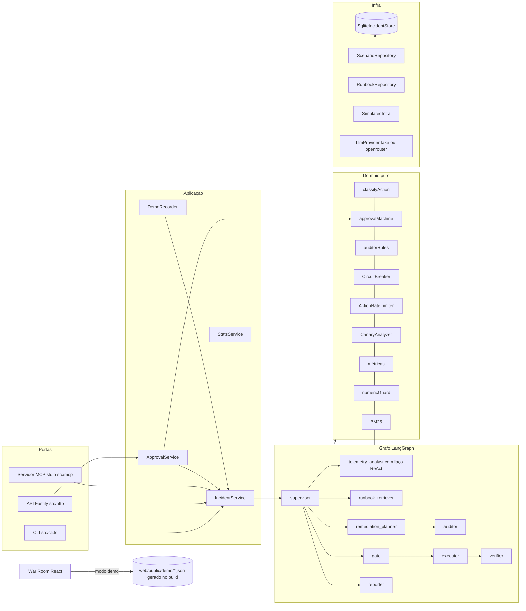
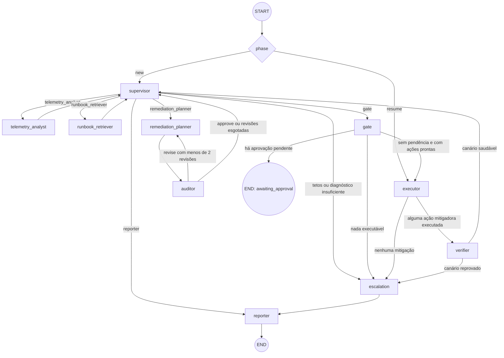
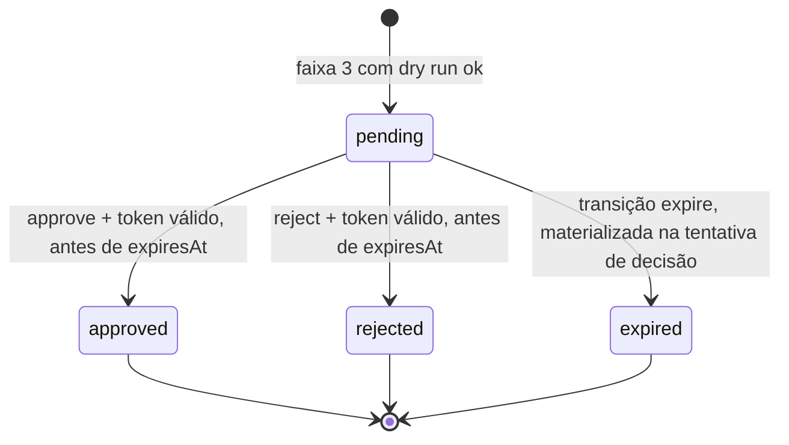

# Arquitetura

O `incident-copilot` tem uma regra só: **o modelo propõe; o código e o humano decidem.** O LLM escolhe o próximo especialista, investiga, monta o plano, pode pedir revisão e redige o post-mortem. Código determinístico faz o resto:

- classifica o risco de cada passo;
- decide o que roda sozinho;
- impõe o piso de qualidade do plano;
- guarda a aprovação;
- calcula os números;
- grava a auditoria.

Este documento reúne os três diagramas do desenho (componentes, grafo e máquina de aprovação), a tabela de rotas e a regra de dependência entre camadas.

## Componentes

Tudo é montado por `createContainer` (`src/app/container.ts`), a única fonte usada pela API, pelo MCP, pela CLI e pelos testes. Os testes usam `createTestContainer` (`tests/helpers/container.ts`), com banco `:memory:`, relógio simulado e provedor fake explícitos.

## Grafo

Como o grafo funciona:

- **Nomes de nó.** O LangGraph recusa um nó com o nome de uma chave do estado, e `supervisor` e `escalation` são chaves do blackboard. Por isso os nós são registrados como `supervisor_agent` e `escalation_node`. As funções de rota devolvem o nome lógico e o `pathMap` de cada aresta traduz (`GRAPH_NODE_ID` em `src/graph/routing.ts`). O trace mostra os nomes lógicos.
- **Laço ReAct dentro do nó.** O `telemetry_analyst` roda o laço num `for` de até 12 passos. Nenhum passo conta como superstep do grafo: um subgrafo herdaria o `recursionLimit` do pai e estouraria antes do 12º passo. Esse comportamento está travado em `tests/unit/api-assumptions.unit.test.ts`.
- **Pausa e retomada.** A primeira invocação para em `awaiting_approval` ou termina. A retomada é uma nova invocação com o blackboard carregado do banco e `phase: "resume"`, e entra pelo executor. Não há checkpointer.
- **Tetos.** Cada invocação usa `graph.stream(..., { streamMode: "values", recursionLimit: 25, signal })`, com `signal = AbortSignal.timeout(RUN_TIMEOUT_MS)`. O `IncidentService` guarda o último estado emitido. Em `GraphRecursionError` ou timeout, ele chama direto as funções dos nós `escalation` e `reporter`, preservando o diagnóstico e o plano já obtidos.
  - O timer de `AbortSignal.timeout` só dispara quando o event loop roda timers. Uma execução sem I/O (fake sem `delayMs`, SQLite síncrono, `await` em microtarefa) nunca cede, então o `IncidentService` também confere o prazo pelo relógio a cada estado emitido e aborta o mesmo sinal. Assim `RUN_TIMEOUT_MS` é teto com granularidade de um superstep, com ou sem rede (`resilience.e2e.test.ts`, "RUN_TIMEOUT_MS is a ceiling even when the run never yields...").
  - `LLM_TIMEOUT_MS` continua só no timer de `withTimeout`, por chamada. Ele vale para o OpenRouter, que sempre faz I/O, e para turnos do fake com `delayMs`. O fake sem atraso responde em 0 ms medidos, então nunca passa do prazo; conferir o prazo depois da resposta mudaria qual turno da fixture cada tentativa consome e tiraria o determinismo da demo.

## Rotas decididas por código

Nenhuma rota para `escalation` vem do LLM: `SupervisorDecisionSchema` não tem essa opção. Qualquer nó que defina `state.escalation` desvia para o escalonamento na aresta seguinte. As funções estão em `src/graph/routing.ts` e são testadas em `tests/unit/routing.unit.test.ts`.

| Origem | Condição (avaliada em ordem) | Destino |
|---|---|---|
| `START` | `phase === "new"` | `supervisor` |
| `START` | `phase === "resume"` | `executor` |
| `supervisor` | `escalation` definida pelo próprio nó (tetos, diagnóstico fraco, LLM indisponível) | `escalation` |
| `supervisor` | decisão validada pela guarda (`done` vira `reporter`) | especialista escolhido |
| `telemetry_analyst`, `runbook_retriever` | `escalation` definida (LLM indisponível) | `escalation` |
| `telemetry_analyst`, `runbook_retriever` | caso contrário | `supervisor` |
| `remediation_planner` | `escalation` definida | `escalation`; senão `auditor` |
| `auditor` | veredito final `revise` e `planRevision < limits.maxPlanRevisions` | `remediation_planner` |
| `auditor` | caso contrário | `supervisor` |
| `gate` | existe aprovação `pending` | `END` |
| `gate` | existe ação `ready` | `executor` |
| `gate` | caso contrário | `escalation` (`no_executable_actions`) |
| `executor` | alguma ação com `mitigates: true` terminou `succeeded` | `verifier` |
| `executor` | caso contrário | `escalation` (motivo pela prioridade `circuit_open`, `throttled`, `mitigation_rejected`, `no_executable_actions`) |
| `verifier` | canário saudável | `supervisor` |
| `verifier` | canário reprovado | `escalation` (`remediation_ineffective`) |
| `escalation` | sempre | `reporter` |
| `reporter` | sempre | `END` |

O status do incidente é derivado do blackboard e das aprovações por uma função pura, `deriveIncidentStatus` (`src/domain/status/derive-status.ts`). Em ordem:

1. `escalation` presente → `escalated`;
2. post-mortem final → `resolved`;
3. aprovação com status efetivo `pending` → `awaiting_approval`;
4. fase de execução, verificação ou retomada → `mitigating`;
5. fase `new` → `open`;
6. caso contrário → `investigating`.

## Máquina de estados da aprovação

- **Transição pura.** `transition(approval, event, now)` (`src/domain/approval/approval-machine.ts`) devolve a nova aprovação ou um erro tipado. De qualquer estado que não seja `pending`, toda transição devolve erro, e a API responde 409.
- **Leitura sem gravação.** `effectiveStatus(approval, now)` projeta `expired` para GET, `IncidentView`, `/stats` e War Room, sem gravar nada.
- **Texto livre restrito.** `parseDecision(text)` aceita só a frase inteira igual a um termo das listas fechadas, depois da normalização. Qualquer outra coisa é ambígua e recebe 422.
- **Ordem em `POST /approvals/:id/decision`:**
  1. corpo (400);
  2. `APPROVAL_TOKEN` configurado (503);
  3. bloqueio por tentativas (429);
  4. token (401);
  5. texto ambíguo (422);
  6. aprovação existe (404);
  7. expiração (409 `approval_expired`);
  8. status `pending` (409 `approval_not_pending`);
  9. nenhuma execução em andamento no incidente (409 `incident_not_accepting`): o portão grava a aprovação antes de a execução gravar o blackboard, e uma decisão nessa janela mudaria o blackboard por baixo dela;
  10. transição.
- **Rejeição e expiração.** Cancelam o passo e, transitivamente, os passos que dependem dele. O lote só executa quando todos os passos estão decididos.

## Regra de dependência

- `src/contracts` e `src/domain` não importam módulos `node:*` nem nada de `infra`, `llm`, `graph`, `app`, `http`, `mcp` ou `cli`. A War Room reaproveita os dois no navegador. Isso é verificado em `tests/unit/contracts.unit.test.ts` ("contracts and domain import neither node: nor outer layers").
- `graph` recebe as dependências por fábrica (`createXNode(deps)`), e cada nó recebe só o que usa. `gate`, `executor`, `verifier`, `runbook_retriever` e `escalation` não recebem `llm`.
  - Das camadas de fora, os nós importam só tipos (`import type`): `LlmProvider`, `Clock`, `SimulatedInfra`, `ScenarioRepository`, `TraceSink`. Alguns desses tipos são as próprias classes, não interfaces separadas; como a dependência é só de tipo e a instância vem pela fábrica, os testes injetam dublês.
  - Em tempo de execução, os nós importam o domínio, os prompts e dois utilitários de formatação do trace (`clip` e `llmInfoOf`, de `src/app/trace-sink.ts`).
- As portas (`http`, `mcp`, `cli`) falam com `app` para regras e dados. Elas usam só utilitários transversais de `infra`: redação de segredos, caminhos do projeto e versão do app. A exceção é a CLI `diagnose`, que monta o nó do analista diretamente, por ser um comando de diagnóstico isolado que não abre incidente pelo serviço.
- O SQL não tem enum próprio: os `CHECK` são gerados dos mesmos enums Zod de `src/contracts` (`src/infra/db/schema.ts`). `tests/unit/store-audit.unit.test.ts` confere a igualdade.
